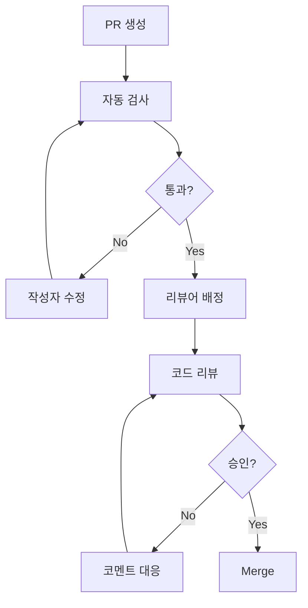

# CODE_REVIEW_GUIDE.md - 코드 리뷰 가이드

> **이 문서는 효과적인 코드 리뷰를 위한 가이드라인을 제공합니다.**
> 리뷰어와 작성자 모두 이 가이드를 참고하여 건설적인 리뷰를 진행해 주세요.

---

## 변경 이력 (Changelog)

| 버전 | 날짜 | 작성자 | 변경 내용 |
|------|------|--------|----------|
| 1.0.0 | 2025-11-25 | @Prometheus-P | 최초 작성 |

## 관련 문서 (Related Documents)

- [CONTRIBUTING.md](./CONTRIBUTING.md) - 기여 가이드
- [VERSIONING_GUIDE.md](./VERSIONING_GUIDE.md) - 버전 관리 가이드
- [docs/TDD_RULES.md](./docs/TDD_RULES.md) - TDD 규칙

---

## 📋 목차

1. [코드 리뷰의 목적](#1-코드-리뷰의-목적)
2. [리뷰어 가이드](#2-리뷰어-가이드)
3. [작성자 가이드](#3-작성자-가이드)
4. [리뷰 체크리스트](#4-리뷰-체크리스트)
5. [리뷰 코멘트 작성법](#5-리뷰-코멘트-작성법)
6. [리뷰 프로세스](#6-리뷰-프로세스)
7. [자동화 도구](#7-자동화-도구)

---

## 1. 코드 리뷰의 목적

### 1.1 왜 코드 리뷰를 하는가?

```
┌─────────────────────────────────────────────────────────────┐
│  🎯 코드 리뷰의 4가지 목표                                    │
├─────────────────────────────────────────────────────────────┤
│                                                             │
│  1. 📚 지식 공유                                             │
│     - 팀 전체의 코드베이스 이해도 향상                        │
│     - 새로운 기술/패턴 전파                                  │
│                                                             │
│  2. 🐛 버그 예방                                             │
│     - 잠재적 문제 조기 발견                                  │
│     - 엣지 케이스 검토                                       │
│                                                             │
│  3. 📏 품질 유지                                             │
│     - 코딩 표준 준수 확인                                    │
│     - 일관된 아키텍처 유지                                   │
│                                                             │
│  4. 🌱 성장                                                  │
│     - 건설적인 피드백을 통한 학습                            │
│     - 더 나은 코드 작성 습관 형성                            │
│                                                             │
└─────────────────────────────────────────────────────────────┘
```

### 1.2 코드 리뷰가 아닌 것

- ❌ 개인에 대한 비판
- ❌ 스타일 전쟁 (린터가 처리)
- ❌ 완벽주의 추구
- ❌ 권력 행사

---

## 2. 리뷰어 가이드

### 2.1 리뷰어의 마음가짐

```
✅ DO (해야 할 것)
━━━━━━━━━━━━━━━━━━━━━━━━━━━━━━━━━━━━━━━━━━━━━━━━━
• 작성자를 존중하며 리뷰
• 질문 형태로 의견 제시
• 대안 제시 시 이유 설명
• 좋은 부분도 칭찬
• 신속하게 리뷰 (24시간 이내)

❌ DON'T (하지 말아야 할 것)
━━━━━━━━━━━━━━━━━━━━━━━━━━━━━━━━━━━━━━━━━━━━━━━━━
• "이건 완전 틀렸어" (인신공격)
• "왜 이렇게 했어?" (공격적 질문)
• "난 항상 이렇게 해" (독단)
• 사소한 것에 집착
• 리뷰 지연
```

### 2.2 효과적인 리뷰 방법

**1단계: 전체 맥락 파악**

```markdown
□ PR 설명 읽기
□ 관련 이슈 확인
□ 변경 범위 파악
□ 테스트 결과 확인
```

**2단계: 구조적 검토**

```markdown
□ 아키텍처 적합성
□ 디자인 패턴 적절성
□ 모듈 간 의존성
□ 확장성 고려
```

**3단계: 상세 검토**

```markdown
□ 로직 정확성
□ 엣지 케이스 처리
□ 에러 핸들링
□ 성능 영향
□ 보안 고려
```

**4단계: 테스트 검토**

```markdown
□ 테스트 커버리지
□ 테스트 케이스 적절성
□ 테스트 명명 규칙
□ 테스트 가독성
```

### 2.3 리뷰 우선순위

| 우선순위 | 항목 | 블로킹 |
|----------|------|--------|
| 🔴 Critical | 버그, 보안 취약점 | Yes |
| 🟠 High | 로직 오류, 성능 문제 | Yes |
| 🟡 Medium | 설계 개선, 가독성 | No |
| 🟢 Low | 스타일, 네이밍 | No |
| 💭 Nitpick | 개인 선호 | No |

---

## 3. 작성자 가이드

### 3.1 리뷰받기 좋은 PR 만들기

**PR 크기 제한**

```
┌─────────────────────────────────────────────────────────────┐
│  📊 PR 크기 가이드라인                                       │
├─────────────────────────────────────────────────────────────┤
│                                                             │
│  이상적:    ~100줄     ████░░░░░░                           │
│  허용:      ~300줄     ████████░░                           │
│  주의:      ~500줄     ████████████                         │
│  위험:      500줄+     ████████████████ ← 분할 필요         │
│                                                             │
│  큰 기능 = 여러 개의 작은 PR로 분할                          │
│                                                             │
└─────────────────────────────────────────────────────────────┘
```

**좋은 PR 설명**

```markdown
## 요약
사용자가 경주 상세 페이지에서 실시간 배당률을 확인할 수 있도록
OddsDisplay 컴포넌트를 추가합니다.

## 변경 사항
- OddsDisplay 컴포넌트 추가 (Server Component)
- useOdds 훅 구현 (30초 폴링)
- RaceDetail 페이지에 배당률 섹션 추가

## 테스트 방법
1. 개발 서버 실행 (`npm run dev`)
2. 경주 상세 페이지 접속 (/race/123)
3. 배당률 섹션 확인
4. 30초 후 자동 갱신 확인

## 스크린샷
[배당률 UI 스크린샷]

## 관련 이슈
Closes #123
```

### 3.2 리뷰 피드백 대응

```
✅ DO (해야 할 것)
━━━━━━━━━━━━━━━━━━━━━━━━━━━━━━━━━━━━━━━━━━━━━━━━━
• 모든 코멘트에 응답
• 수정한 내용 설명
• 동의하지 않으면 이유 설명
• 추가 논의가 필요하면 대화 요청
• 감사 표시

❌ DON'T (하지 말아야 할 것)
━━━━━━━━━━━━━━━━━━━━━━━━━━━━━━━━━━━━━━━━━━━━━━━━━
• 코멘트 무시
• 방어적 태도
• 설명 없이 수정
• 감정적 대응
```

### 3.3 셀프 리뷰 체크리스트

PR 생성 전 스스로 검토:

```markdown
## 셀프 리뷰

### 기능
- [ ] 요구사항을 모두 충족하는가?
- [ ] 엣지 케이스를 처리했는가?
- [ ] 에러 상황을 적절히 처리했는가?

### 코드 품질
- [ ] 불필요한 코드가 없는가?
- [ ] 중복 코드가 없는가?
- [ ] 네이밍이 명확한가?
- [ ] 함수/클래스가 단일 책임인가?

### 테스트
- [ ] 새 기능에 대한 테스트가 있는가?
- [ ] 모든 테스트가 통과하는가?
- [ ] 테스트 커버리지가 충분한가?

### 문서
- [ ] 필요한 주석을 추가했는가?
- [ ] README 업데이트가 필요한가?
```

---

## 4. 리뷰 체크리스트

### 4.1 필수 체크리스트 (모든 PR)

```markdown
## 🔴 필수 검토 항목

### 정확성
- [ ] 로직이 올바른가?
- [ ] 버그가 없는가?
- [ ] 요구사항을 충족하는가?

### 테스트
- [ ] 테스트가 추가/수정되었는가?
- [ ] 모든 테스트가 통과하는가?
- [ ] 테스트 커버리지가 충분한가?

### 보안
- [ ] 입력 검증이 적절한가?
- [ ] 인증/인가가 올바른가?
- [ ] 민감 정보가 노출되지 않는가?

### 성능
- [ ] 불필요한 연산이 없는가?
- [ ] N+1 쿼리 문제가 없는가?
- [ ] 메모리 누수 가능성이 없는가?
```

### 4.2 TypeScript 체크리스트

```markdown
## TypeScript 검토

### 타입 안전성
- [ ] `any` 타입 사용을 피했는가?
- [ ] 타입 단언(as)을 최소화했는가?
- [ ] null/undefined 처리가 적절한가?
- [ ] 제네릭을 적절히 활용했는가?

### 인터페이스
- [ ] 인터페이스 네이밍이 명확한가?
- [ ] 필수/선택 속성이 적절한가?
- [ ] 타입 재사용이 가능한가?
```

### 4.3 React/Next.js 체크리스트

```markdown
## React/Next.js 검토

### 컴포넌트
- [ ] Server/Client 구분이 적절한가?
- [ ] Props 타입이 정의되었는가?
- [ ] 불필요한 리렌더링이 없는가?
- [ ] 컴포넌트가 단일 책임인가?

### 훅
- [ ] 의존성 배열이 올바른가?
- [ ] 메모이제이션이 적절한가?
- [ ] 커스텀 훅 추출이 필요한가?

### 데이터 페칭
- [ ] 에러 처리가 있는가?
- [ ] 로딩 상태를 처리하는가?
- [ ] 캐싱 전략이 적절한가?
```

### 4.4 API 체크리스트

```markdown
## API 검토

### 설계
- [ ] RESTful 원칙을 따르는가?
- [ ] 엔드포인트 네이밍이 적절한가?
- [ ] HTTP 메서드가 올바른가?

### 응답
- [ ] 응답 형식이 일관적인가?
- [ ] 에러 응답이 명확한가?
- [ ] 상태 코드가 적절한가?

### 검증
- [ ] 입력 검증이 있는가?
- [ ] 권한 검사가 있는가?
- [ ] Rate limiting이 필요한가?
```

---

## 5. 리뷰 코멘트 작성법

### 5.1 코멘트 프리픽스

| 프리픽스 | 의미 | 예시 |
|----------|------|------|
| `[blocking]` | 수정 필수 | `[blocking] 이 조건에서 NullPointerException이 발생합니다` |
| `[suggestion]` | 제안 (선택) | `[suggestion] 이 로직을 별도 함수로 추출하면 테스트가 쉬워집니다` |
| `[question]` | 질문 | `[question] 이 타임아웃 값의 기준이 무엇인가요?` |
| `[nitpick]` | 사소한 의견 | `[nitpick] 변수명을 좀 더 구체적으로 하면 어떨까요?` |
| `[praise]` | 칭찬 | `[praise] 이 에러 처리 방식 좋네요!` |

### 5.2 좋은 코멘트 예시

**질문 형태로**
```markdown
// ❌ 나쁜 예
이 코드는 잘못됐어요.

// ✅ 좋은 예
[question] race가 null인 경우 이 라인에서 에러가 발생할 것 같은데,
이 케이스에 대한 처리가 필요하지 않을까요?
```

**대안 제시**
```markdown
// ❌ 나쁜 예
이 방식은 비효율적이에요.

// ✅ 좋은 예
[suggestion] 현재 구현은 매번 필터링을 수행하는데,
useMemo를 사용하면 불필요한 연산을 줄일 수 있습니다:

\`\`\`typescript
const filteredRaces = useMemo(
  () => races.filter(r => r.status === 'active'),
  [races]
);
\`\`\`
```

**구체적으로**
```markdown
// ❌ 나쁜 예
테스트가 부족해요.

// ✅ 좋은 예
[blocking] API 호출이 실패하는 경우에 대한 테스트가 없습니다.
다음 케이스에 대한 테스트를 추가해 주세요:
- 네트워크 에러 (fetch 실패)
- 400/401/500 응답
- 타임아웃
```

### 5.3 긍정적 피드백도 중요

```markdown
// 좋은 코드를 발견했을 때
[praise] 에러 바운더리 패턴을 잘 적용했네요!
사용자 경험이 훨씬 나아질 것 같습니다.

// 개선을 인정할 때
[praise] 이전 코드보다 훨씬 가독성이 좋아졌습니다.
특히 조건문을 early return으로 바꾼 부분이 좋네요.
```

---

## 6. 리뷰 프로세스

### 6.1 리뷰 플로우



### 6.2 리뷰 SLA

| 항목 | 목표 시간 |
|------|----------|
| 최초 리뷰 시작 | 24시간 이내 |
| 리뷰 완료 | 48시간 이내 |
| 코멘트 응답 | 24시간 이내 |
| 재리뷰 | 24시간 이내 |

### 6.3 승인 기준

**Merge 조건:**
- ✅ 최소 1명의 승인
- ✅ 모든 blocking 코멘트 해결
- ✅ CI 파이프라인 통과
- ✅ 충돌 없음

### 6.4 긴급 리뷰

프로덕션 이슈 등 긴급한 경우:

```markdown
## 긴급 리뷰 요청 시

1. PR 제목에 [URGENT] 태그 추가
2. 슬랙/팀즈로 리뷰어에게 직접 알림
3. PR 설명에 긴급한 이유 명시
4. 가능하면 최소한의 변경만 포함

예: [URGENT] fix(api): 프로덕션 배당률 API 500 에러 수정
```

---

## 7. 자동화 도구

### 7.1 CI에서 자동 검사

```yaml
# .github/workflows/ci.yml

name: CI

on: [pull_request]

jobs:
  check:
    runs-on: ubuntu-latest
    steps:
      # 린트 검사
      - name: Lint
        run: npm run lint

      # 타입 검사
      - name: Type Check
        run: npm run type-check

      # 단위 테스트
      - name: Unit Test
        run: npm test -- --coverage

      # 빌드 테스트
      - name: Build
        run: npm run build
```

### 7.2 자동 리뷰어 배정

```yaml
# .github/CODEOWNERS

# 기본 리뷰어
* @Prometheus-P

# 프론트엔드
/src/components/ @frontend-team
/src/app/ @frontend-team

# 백엔드 API
/src/app/api/ @backend-team

# 인프라
/.github/ @devops-team
/infra/ @devops-team
```

### 7.3 PR 템플릿 자동 적용

```markdown
<!-- .github/PULL_REQUEST_TEMPLATE.md -->

## 요약
<!-- 변경 사항 간략히 설명 -->

## 변경 유형
- [ ] 버그 수정
- [ ] 새 기능
- [ ] 리팩토링
- [ ] 문서

## 관련 이슈
<!-- Closes #이슈번호 -->

## 체크리스트
- [ ] 테스트 추가/수정
- [ ] 문서 업데이트
- [ ] 셀프 리뷰 완료
```

---

## 📋 빠른 참조

### 리뷰어 퀵 가이드

```
1. PR 설명 읽기 (맥락 파악)
2. 파일 변경 확인 (Files changed)
3. 구조 → 상세 순서로 검토
4. 코멘트 작성 (프리픽스 사용)
5. 최종 리뷰 제출
   - Approve: 문제 없음
   - Request changes: 수정 필요
   - Comment: 의견만 (blocking 없음)
```

### 작성자 퀵 가이드

```
1. 작은 PR 만들기 (~300줄)
2. 명확한 설명 작성
3. 셀프 리뷰 먼저
4. 모든 코멘트에 응답
5. 수정 후 re-request review
```

### 코멘트 프리픽스 요약

```
[blocking]   → 수정 필수
[suggestion] → 제안 (선택)
[question]   → 질문
[nitpick]    → 사소한 의견
[praise]     → 칭찬
```

---

*좋은 코드 리뷰는 더 나은 코드와 더 강한 팀을 만듭니다.* 🚀
