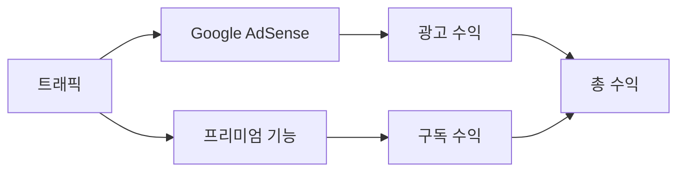
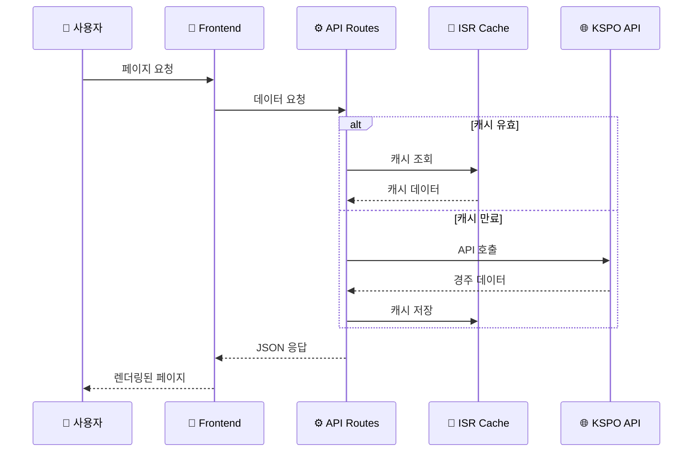
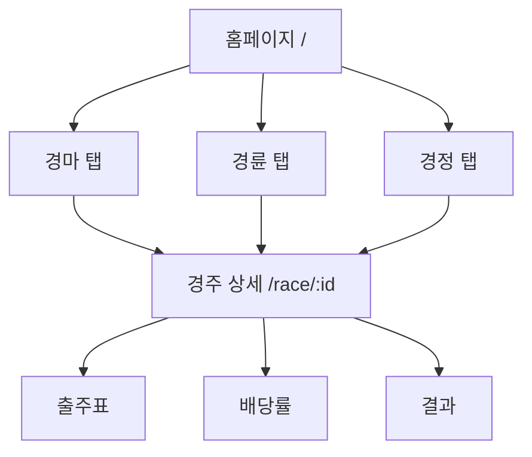

# CONTEXT.md - KRace 프로젝트 Single Source of Truth

> **이 문서는 RaceLab 프로젝트의 모든 맥락을 담은 단일 진실 공급원(Single Source of Truth)입니다.**
> **최신 릴리즈 버전(`v1.4 Refine`)의 현황과 주요 기술/비즈니스 컨텍스트를 제공합니다.**
> AI 에이전트와 개발자 모두 이 문서를 참조하여 프로젝트를 이해하고 일관된 방향성을 유지합니다.

---

## 변경 이력 (Changelog)

| 버전  | 날짜       | 작성자        | 변경 내용 |
| ----- | ---------- | ------------- | --------- |
| 1.0.0 | 2025-11-25 | @Prometheus-P | 최초 작성 |
| 1.4.0 | 2025-12-09 | @Prometheus-P | v1.4 Refine Cycle - 최소 프로덕션 수준으로 개선 |

## 관련 문서 (Related Documents)

- [README.md](./README.md) - 빠른 시작 가이드
- [plan.md](./plan.md) - TDD 개발 계획
- [기술 설계서](./docs/technical/TECHNICAL_DESIGN.md) - 시스템 아키텍처
- [API 명세서](./docs/technical/API_SPECIFICATION.md) - API 상세 스펙
- [개발 가이드](./docs/technical/DEVELOPMENT_GUIDE.md) - 코딩 컨벤션

---

## 1. 프로젝트 개요 (Project Overview)

### 1.1 프로젝트 정보

| 항목           | 내용                 |
| -------------- | -------------------- |
| **프로젝트명** | KRace (케이레이스)   |
| **버전**       | 1.4.0                |
| **도메인**     | racelab.kr           |
| **저장소**     | Prometheus-P/racelab |
| **라이선스**   | ISC                  |

### 1.2 한 줄 요약

> **한국 공영 경주(경마/경륜/경정) 정보를 실시간으로 제공하는 웹 서비스**

### 1.3 프로젝트 비전

```
"경마, 경륜, 경정 정보를 가장 빠르고 정확하게,
누구나 쉽게 접근할 수 있는 국내 최고의 경주 정보 플랫폼"
```

### 1.4 핵심 가치 제안 (Value Proposition)

1. **통합 정보**: 경마/경륜/경정 3개 종목을 한 곳에서 조회
2. **실시간성**: KSPO 공공 API를 통한 실시간 데이터 제공
3. **접근성**: 모바일 최적화, 직관적 UI로 누구나 쉽게 사용
4. **신뢰성**: 공식 데이터 기반, 정확한 정보 제공

---

## 2. 비즈니스 컨텍스트 (Business Context)

### 2.1 타겟 사용자

| 세그먼트        | 설명                             | 비율 |
| --------------- | -------------------------------- | ---- |
| **핵심 사용자** | 30-60세 남성, 경주 참여자        | 70%  |
| **정보 탐색자** | 경주 결과/통계 확인 목적         | 20%  |
| **신규 입문자** | 경주에 관심을 갖기 시작한 사용자 | 10%  |

### 2.2 사용자 페르소나

```
👤 김영수 (52세, 회사원)
━━━━━━━━━━━━━━━━━━━━━━━━━━━━━━━━━━━━━━━━━━━━━━━━━
목표: 주말 경마장 방문 전 오늘의 경주 정보 빠르게 확인
고충: 기존 사이트가 복잡하고 모바일에서 불편함
기대: 출퇴근 시간에 스마트폰으로 간편하게 정보 확인
```

### 2.3 핵심 지표 (North Star Metrics)

| 지표                 | 목표     | 측정 방법        |
| -------------------- | -------- | ---------------- |
| **DAU**              | 10,000명 | Google Analytics |
| **페이지 체류 시간** | 3분 이상 | GA 세션 분석     |
| **재방문율**         | 40% 이상 | GA 리턴 유저     |
| **페이지 로드 시간** | 2초 이내 | Vercel Analytics |

### 2.4 수익 모델



| 수익원         | Phase   | 설명                      |
| -------------- | ------- | ------------------------- |
| Google AdSense | MVP     | 배너 광고 (비침해적 배치) |
| 프리미엄 구독  | Phase 2 | 상세 통계, 알림 기능      |

---

## 3. 기술 컨텍스트 (Technical Context)

### 3.1 기술 스택

```
┌─────────────────────────────────────────────────────────────┐
│                      FRONTEND                                │
├─────────────────────────────────────────────────────────────┤
│  Next.js 14.2.33 (App Router)                               │
│  React 18.3.1                                                │
│  TypeScript 5.9.3                                            │
│  Tailwind CSS 3.4.0                                          │
└─────────────────────────────────────────────────────────────┘
                              │
                              ▼
┌─────────────────────────────────────────────────────────────┐
│                      BACKEND (API Routes)                    │
├─────────────────────────────────────────────────────────────┤
│  Next.js API Routes (Edge Runtime 지원)                      │
│  Server Components (데이터 페칭)                              │
│  ISR (Incremental Static Regeneration)                       │
└─────────────────────────────────────────────────────────────┘
                              │
                              ▼
┌─────────────────────────────────────────────────────────────┐
│                      EXTERNAL APIs                           │
├─────────────────────────────────────────────────────────────┤
│  KSPO 공공데이터 API (경마/경륜/경정)                          │
│  - 경주 일정, 출주표, 배당률, 결과                            │
└─────────────────────────────────────────────────────────────┘
                              │
                              ▼
┌─────────────────────────────────────────────────────────────┐
│                      INFRASTRUCTURE                          │
├─────────────────────────────────────────────────────────────┤
│  Vercel (호스팅, CDN, Edge Functions)                        │
│  Cloudflare (DNS, DDoS 보호)                                 │
│  Google Analytics 4 (분석)                                   │
└─────────────────────────────────────────────────────────────┘
```

### 3.2 핵심 의존성

```json
{
  "dependencies": {
    "next": "14.2.33",
    "react": "^18.3.1",
    "react-dom": "^18.3.1",
    "@vercel/analytics": "^1.5.0"
  },
  "devDependencies": {
    "typescript": "^5.9.3",
    "tailwindcss": "^3.4.0",
    "jest": "^30.2.0",
    "@testing-library/react": "^16.3.0",
    "@playwright/test": "^1.56.1"
  }
}
```

### 3.3 디렉토리 구조

```
📦 racelab/
├── 📄 CONTEXT.md                 # 이 문서 (Single Source of Truth)
├── 📄 README.md                  # 빠른 시작 가이드
├── 📄 plan.md                    # TDD 개발 계획
│
├── 📁 docs/                      # 문서 루트
│   ├── 📁 technical/             # 기술 문서
│   │   ├── TECHNICAL_DESIGN.md   # 시스템 아키텍처
│   │   ├── API_SPECIFICATION.md  # API 명세
│   │   └── DEVELOPMENT_GUIDE.md  # 개발 가이드
│   ├── 📁 business/              # 비즈니스 문서
│   │   ├── PROJECT_CHARTER.md    # 프로젝트 헌장
│   │   └── SEO_MARKETING.md      # SEO 전략
│   └── 📁 operations/            # 운영 문서
│       └── DEPLOYMENT_OPERATIONS.md
│
├── 📁 src/                       # 소스 코드
│   ├── 📁 app/                   # Next.js App Router
│   │   ├── page.tsx              # 홈페이지
│   │   ├── layout.tsx            # 루트 레이아웃
│   │   ├── 📁 race/[id]/         # 경주 상세 페이지
│   │   └── 📁 api/races/         # API 라우트
│   ├── 📁 components/            # React 컴포넌트
│   ├── 📁 lib/                   # 유틸리티 & API 헬퍼
│   └── 📁 types/                 # TypeScript 타입 정의
│
├── 📁 e2e/                       # E2E 테스트 (Playwright)
│   ├── 📁 pages/                 # Page Object Models
│   └── 📁 tests/                 # 테스트 스펙
│
└── 📁 .github/workflows/         # CI/CD 파이프라인
```

### 3.4 데이터 흐름



---

## 4. 핵심 기능 (Core Features)

### 4.1 기능 매트릭스

| 기능             | Phase   | 상태      | 설명                     |
| ---------------- | ------- | --------- | ------------------------ |
| 오늘의 경주 목록 | MVP     | ✅ 완료   | 경마/경륜/경정 탭별 조회 |
| 경주 상세 정보   | MVP     | ✅ 완료   | 출주표, 기수/선수 정보   |
| 실시간 배당률    | MVP     | 🔄 진행중 | 단승/복승/쌍승 배당      |
| 경주 결과 조회   | MVP     | 🔄 진행중 | 착순, 배당금             |
| 반응형 UI        | MVP     | ✅ 완료   | 모바일 최적화            |
| SEO 최적화       | MVP     | ✅ 완료   | sitemap, robots.txt      |
| 결과 히스토리    | Phase 2 | ⏳ 예정   | 과거 경주 결과 검색      |
| 알림 서비스      | Phase 2 | ⏳ 예정   | 관심 경주 푸시 알림      |
| 통계 분석        | Phase 2 | ⏳ 예정   | 기수/선수 성적 분석      |

### 4.2 페이지 구조



### 4.3 API 엔드포인트

| 엔드포인트                       | 메서드 | 설명           |
| -------------------------------- | ------ | -------------- |
| `/api/races/horse`               | GET    | 경마 경주 목록 |
| `/api/races/cycle`               | GET    | 경륜 경주 목록 |
| `/api/races/boat`                | GET    | 경정 경주 목록 |
| `/api/races/[type]/[id]/entries` | GET    | 출주표         |
| `/api/races/[type]/[id]/odds`    | GET    | 배당률         |
| `/api/races/[type]/[id]/results` | GET    | 결과           |

---

## 5. 개발 방법론 (Development Methodology)

### 5.1 TDD (Test-Driven Development)

```
┌─────────┐     ┌─────────┐     ┌───────────┐
│   RED   │ ──▶ │  GREEN  │ ──▶ │ REFACTOR  │
│ (실패)  │     │ (통과)   │     │ (개선)    │
└─────────┘     └─────────┘     └───────────┘
     │                               │
     └───────────────────────────────┘
              사이클 반복
```

**TDD 규칙:**

1. 실패하는 테스트 없이 프로덕션 코드 작성 금지
2. 테스트는 하나의 실패 이유만 가져야 함
3. 테스트 통과를 위한 최소한의 코드만 작성
4. 리팩토링 시 동작 변경 금지

### 5.2 커밋 컨벤션

```
<type>(<scope>): <subject>

[optional body]
```

**타입 목록:**

| Type       | 설명      | 예시                               |
| ---------- | --------- | ---------------------------------- |
| `feat`     | 새 기능   | `feat(race): add odds display`     |
| `fix`      | 버그 수정 | `fix(api): handle null response`   |
| `refactor` | 리팩토링  | `refactor(lib): extract mapper`    |
| `test`     | 테스트    | `test(api): add horse races test`  |
| `docs`     | 문서      | `docs(readme): update setup guide` |
| `chore`    | 빌드/설정 | `chore(deps): upgrade next.js`     |

### 5.3 브랜치 전략

```
main (production)
  │
  ├── develop (integration)
  │     │
  │     ├── feature/add-odds-display
  │     ├── feature/improve-seo
  │     └── fix/api-timeout
  │
  └── hotfix/critical-bug
```

---

## 6. 품질 기준 (Quality Standards)

### 6.1 테스트 커버리지 목표

| 테스트 유형      | 목표               | 현재    |
| ---------------- | ------------------ | ------- |
| Unit Test        | 80%                | ~70%    |
| Integration Test | 60%                | ~50%    |
| E2E Test         | Critical Path 100% | ✅ 완료 |

### 6.2 성능 기준

| 지표                           | 기준    | 측정 도구        |
| ------------------------------ | ------- | ---------------- |
| LCP (Largest Contentful Paint) | < 2.5s  | Lighthouse       |
| FID (First Input Delay)        | < 100ms | Lighthouse       |
| CLS (Cumulative Layout Shift)  | < 0.1   | Lighthouse       |
| TTFB (Time to First Byte)      | < 600ms | Vercel Analytics |

### 6.3 코드 품질 규칙

| 항목        | 기준           |
| ----------- | -------------- |
| 함수 길이   | 20줄 이하      |
| 클래스 길이 | 200줄 이하     |
| 파일 길이   | 400줄 이하     |
| 중첩 깊이   | 3단계 이하     |
| 매개변수 수 | 4개 이하       |
| 매직 넘버   | 상수 추출 필수 |

---

## 7. 환경 설정 (Environment Setup)

### 7.1 필수 환경 변수

```bash
# .env.local.example

# 필수
NEXT_PUBLIC_API_URL=https://api.example.com

# 선택 (프로덕션)
NEXT_PUBLIC_GA_ID=G-XXXXXXXXXX
NEXT_PUBLIC_ADSENSE_ID=ca-pub-XXXXXXXX

# 개발용
NEXT_PUBLIC_USE_MOCK_DATA=true
```

### 7.2 로컬 개발 환경

```bash
# 1. 의존성 설치
npm install

# 2. 환경 변수 설정
cp .env.local.example .env.local

# 3. 개발 서버 실행
npm run dev

# 4. 테스트 실행
npm test              # Unit tests
npm run test:e2e      # E2E tests
```

### 7.3 빌드 및 배포

```bash
# 빌드
npm run build

# 프로덕션 서버
npm start

# 린트 검사
npm run lint
```

---

## 8. 제약 사항 및 리스크 (Constraints & Risks)

### 8.1 기술적 제약

| 제약               | 영향                  | 대응 방안                 |
| ------------------ | --------------------- | ------------------------- |
| KSPO API 호출 제한 | 과도한 요청 시 차단   | ISR 캐싱 (30초~5분)       |
| 실시간 데이터 지연 | 배당률 최대 30초 지연 | 사용자에게 갱신 시간 표시 |
| 무료 API 의존성    | 서비스 중단 리스크    | 대체 데이터 소스 확보     |

### 8.2 비즈니스 리스크

| 리스크             | 심각도 | 완화 전략                |
| ------------------ | ------ | ------------------------ |
| 경쟁 서비스 존재   | 중     | UX 차별화, 빠른 로딩     |
| 광고 수익 불확실성 | 중     | 프리미엄 기능으로 다각화 |
| 법적 규제 변화     | 저     | 법률 모니터링            |

### 8.3 알려진 이슈

| ID  | 이슈                       | 상태     | 우선순위 |
| --- | -------------------------- | -------- | -------- |
| #1  | `/public/` 디렉토리 미생성 | 해결됨   | High     |
| #2  | Analytics 통합 미완료      | 진행중   | Medium   |
| #3  | KSPO 매퍼 불완전           | 진행중   | Medium   |

---

## 9. 용어 사전 (Glossary)

| 용어   | 영문                              | 정의                              |
| ------ | --------------------------------- | --------------------------------- |
| 경마   | Horse Racing                      | 기수가 말을 타고 경주하는 스포츠  |
| 경륜   | Cycle Racing                      | 선수가 자전거로 경주하는 스포츠   |
| 경정   | Boat Racing                       | 선수가 모터보트로 경주하는 스포츠 |
| 단승   | Win                               | 1등 예측 베팅                     |
| 복승   | Place                             | 1-2등 예측 베팅                   |
| 쌍승   | Quinella                          | 1-2등 순서 무관 예측              |
| 출주표 | Entry List                        | 경주 참가 선수/말 목록            |
| 배당률 | Odds                              | 베팅 배당 비율                    |
| ISR    | Incremental Static Regeneration   | Next.js 점진적 정적 생성          |
| KSPO   | Korea Sports Promotion Foundation | 국민체육진흥공단                  |

---

## 10. 연락처 및 지원 (Contact & Support)

### 10.1 프로젝트 오너

| 역할          | 담당          | 연락처        |
| ------------- | ------------- | ------------- |
| Project Owner | @Prometheus-P | GitHub Issues |

### 10.2 기여 방법

1. 이슈 생성: GitHub Issues
2. 코드 기여: Pull Request
3. 문서 개선: docs/ 폴더 수정 후 PR

---

## 📋 AI 에이전트 참고 사항

> **이 섹션은 AI 코딩 에이전트를 위한 컨텍스트입니다.**

### 코드 생성 시 준수 사항

1. **언어 규칙**
   - 문서/주석: 한국어 (Korean)
   - 변수/함수/클래스명: English
   - 커밋 메시지: English

2. **파일 생성 위치**
   - 컴포넌트: `src/components/`
   - API 라우트: `src/app/api/`
   - 유틸리티: `src/lib/`
   - 타입 정의: `src/types/`
   - 테스트: 해당 파일 옆에 `*.test.ts(x)`

3. **테스트 작성 필수**
   - 모든 새 기능에 테스트 필수
   - TDD 사이클 준수 (Red → Green → Refactor)

4. **코드 스타일**
   - TypeScript strict mode
   - Tailwind CSS 사용 (inline styles 금지)
   - Server Components 우선 (Client는 필요시에만)

5. **API 호출**
   - ISR 캐싱 활용 (`revalidate` 옵션)
   - 에러 핸들링 필수
   - 타입 안전성 보장

---

_이 문서는 프로젝트의 모든 맥락을 담고 있으며, 지속적으로 업데이트됩니다._
