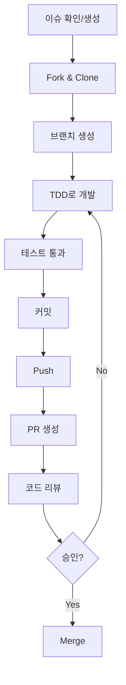

# CONTRIBUTING.md - 기여 가이드

> **이 문서는 KRace 프로젝트에 기여하는 방법을 안내합니다.**
> 모든 기여자는 이 가이드를 숙지한 후 참여해 주세요.

---

## 변경 이력 (Changelog)

| 버전 | 날짜 | 작성자 | 변경 내용 |
|------|------|--------|----------|
| 1.0.0 | 2025-11-25 | @Prometheus-P | 최초 작성 |

## 관련 문서 (Related Documents)

- [CONTEXT.md](./CONTEXT.md) - 프로젝트 컨텍스트
- [CODE_REVIEW_GUIDE.md](./CODE_REVIEW_GUIDE.md) - 코드 리뷰 가이드
- [VERSIONING_GUIDE.md](./VERSIONING_GUIDE.md) - 버전 관리 가이드
- [docs/TDD_RULES.md](./docs/TDD_RULES.md) - TDD 규칙

---

## 📋 목차

1. [기여 방법 개요](#1-기여-방법-개요)
2. [개발 환경 설정](#2-개발-환경-설정)
3. [이슈 작성 가이드](#3-이슈-작성-가이드)
4. [브랜치 전략](#4-브랜치-전략)
5. [커밋 컨벤션](#5-커밋-컨벤션)
6. [Pull Request 가이드](#6-pull-request-가이드)
7. [코드 스타일](#7-코드-스타일)
8. [테스트 가이드](#8-테스트-가이드)
9. [문서화 가이드](#9-문서화-가이드)
10. [행동 강령](#10-행동-강령)

---

## 1. 기여 방법 개요

### 1.1 기여 유형

| 유형 | 설명 | 난이도 |
|------|------|--------|
| 🐛 **버그 리포트** | 버그 발견 시 이슈 생성 | 쉬움 |
| 📝 **문서 개선** | 오타 수정, 설명 보완 | 쉬움 |
| ✨ **기능 제안** | 새로운 기능 아이디어 | 보통 |
| 🔧 **버그 수정** | 이슈에 등록된 버그 수정 | 보통 |
| 🚀 **기능 구현** | 새로운 기능 개발 | 어려움 |
| ♻️ **리팩토링** | 코드 품질 개선 | 어려움 |

### 1.2 기여 프로세스



### 1.3 첫 기여자를 위한 안내

처음 기여하시는 분은 `good first issue` 라벨이 붙은 이슈를 확인해 주세요.

```bash
# GitHub에서 확인
https://github.com/Prometheus-P/racelab/labels/good%20first%20issue
```

---

## 2. 개발 환경 설정

### 2.1 필수 도구

| 도구 | 최소 버전 | 확인 명령어 |
|------|----------|------------|
| Node.js | 18.17.0 | `node --version` |
| npm | 9.0.0 | `npm --version` |
| Git | 2.30.0 | `git --version` |

### 2.2 환경 설정

```bash
# 1. 저장소 Fork (GitHub 웹에서)

# 2. Fork한 저장소 Clone
git clone https://github.com/YOUR_USERNAME/racelab.git
cd racelab

# 3. 원본 저장소 추가 (upstream)
git remote add upstream https://github.com/Prometheus-P/racelab.git

# 4. 의존성 설치
npm install

# 5. 환경 변수 설정
cp .env.local.example .env.local
# .env.local 편집하여 필요한 값 입력

# 6. 개발 서버 실행
npm run dev

# 7. 테스트 실행
npm test
```

### 2.3 동기화

```bash
# upstream의 최신 변경사항 가져오기
git fetch upstream
git checkout main
git merge upstream/main
```

---

## 3. 이슈 작성 가이드

### 3.1 버그 리포트

```markdown
## 버그 설명
[버그에 대한 명확하고 간결한 설명]

## 재현 단계
1. '...'로 이동
2. '...'를 클릭
3. '...'까지 스크롤
4. 에러 발생

## 예상 동작
[정상적으로 동작해야 하는 방식]

## 실제 동작
[실제로 발생한 현상]

## 스크린샷
[해당되는 경우 스크린샷 첨부]

## 환경
- OS: [예: macOS 14.0]
- 브라우저: [예: Chrome 120]
- Node.js: [예: 20.10.0]

## 추가 정보
[문제에 대한 추가 컨텍스트]
```

### 3.2 기능 제안

```markdown
## 기능 설명
[제안하는 기능에 대한 명확한 설명]

## 해결하려는 문제
[이 기능이 해결하는 문제나 불편함]

## 제안 솔루션
[원하는 해결 방법에 대한 설명]

## 대안
[고려한 대안이 있다면 설명]

## 추가 정보
[기능에 대한 추가 컨텍스트나 스크린샷]
```

### 3.3 이슈 라벨

| 라벨 | 설명 |
|------|------|
| `bug` | 버그 리포트 |
| `enhancement` | 기능 개선/추가 |
| `documentation` | 문서 관련 |
| `good first issue` | 첫 기여자에게 적합 |
| `help wanted` | 도움 필요 |
| `priority: high` | 높은 우선순위 |
| `priority: low` | 낮은 우선순위 |

---

## 4. 브랜치 전략

### 4.1 브랜치 구조

```
main                    # 프로덕션 브랜치
├── develop             # 개발 통합 브랜치
│   ├── feature/*       # 기능 개발
│   ├── fix/*           # 버그 수정
│   └── refactor/*      # 리팩토링
└── hotfix/*            # 긴급 수정
```

### 4.2 브랜치 명명 규칙

```
<type>/<issue-number>-<short-description>
```

**예시:**
```bash
feature/123-add-odds-display
fix/456-api-null-response
refactor/789-extract-mapper
docs/012-update-readme
```

### 4.3 브랜치 생성

```bash
# 최신 main에서 브랜치 생성
git checkout main
git pull upstream main
git checkout -b feature/123-add-odds-display
```

---

## 5. 커밋 컨벤션

### 5.1 커밋 메시지 형식

```
<type>(<scope>): <subject>

[optional body]

[optional footer]
```

### 5.2 Type 목록

| Type | 설명 | 예시 |
|------|------|------|
| `feat` | 새로운 기능 | `feat(race): add odds display component` |
| `fix` | 버그 수정 | `fix(api): handle null response from KSPO` |
| `refactor` | 리팩토링 (동작 변경 없음) | `refactor(lib): extract validation logic` |
| `test` | 테스트 추가/수정 | `test(api): add horse races endpoint test` |
| `docs` | 문서 변경 | `docs(readme): update installation guide` |
| `style` | 코드 스타일 변경 | `style(components): fix indentation` |
| `chore` | 빌드/설정 변경 | `chore(deps): upgrade next.js to 14.2.33` |
| `perf` | 성능 개선 | `perf(api): add response caching` |
| `ci` | CI 설정 변경 | `ci(github): add lint workflow` |

### 5.3 Scope 목록

| Scope | 설명 |
|-------|------|
| `api` | API 라우트 |
| `ui` | UI 컴포넌트 |
| `lib` | 유틸리티/헬퍼 |
| `types` | 타입 정의 |
| `e2e` | E2E 테스트 |
| `deps` | 의존성 |
| `config` | 설정 파일 |

### 5.4 커밋 규칙

**필수 규칙:**

1. **원자적 커밋**: 하나의 커밋 = 하나의 논리적 변경
2. **동작하는 상태**: 각 커밋은 빌드/테스트 통과 상태여야 함
3. **Tidy vs Behavior 분리**: 구조적 변경과 동작 변경을 섞지 않음

**예시:**

```bash
# ✅ 좋은 예: 분리된 커밋
git commit -m "refactor(api): extract response mapper function"
git commit -m "feat(api): add odds endpoint"

# ❌ 나쁜 예: 혼합된 커밋
git commit -m "feat(api): add odds endpoint and refactor mapper"
```

### 5.5 커밋 메시지 본문

복잡한 변경의 경우 본문에 상세 설명:

```bash
git commit -m "$(cat <<'EOF'
feat(race): add real-time odds display

- Implement OddsDisplay component with auto-refresh
- Add useOdds hook for polling odds data
- Update RaceDetail page to include odds section

Closes #123
EOF
)"
```

---

## 6. Pull Request 가이드

### 6.1 PR 생성 전 체크리스트

```markdown
## PR 전 확인사항

- [ ] 최신 main 브랜치와 동기화됨
- [ ] 모든 테스트 통과 (`npm test`)
- [ ] 린트 검사 통과 (`npm run lint`)
- [ ] 빌드 성공 (`npm run build`)
- [ ] 커밋 메시지 컨벤션 준수
- [ ] 관련 문서 업데이트 (필요시)
```

### 6.2 PR 템플릿

```markdown
## 요약
[변경 사항에 대한 간략한 설명]

## 변경 유형
- [ ] 버그 수정 (기존 기능을 망가뜨리지 않는 수정)
- [ ] 새 기능 (기존 기능을 망가뜨리지 않는 추가)
- [ ] 파괴적 변경 (기존 기능에 영향을 주는 수정)
- [ ] 문서 변경

## 관련 이슈
Closes #[이슈 번호]

## 변경 내용
- 변경 사항 1
- 변경 사항 2
- 변경 사항 3

## 테스트 방법
1. [테스트 단계 1]
2. [테스트 단계 2]
3. [예상 결과]

## 스크린샷 (UI 변경시)
[변경 전/후 스크린샷]

## 체크리스트
- [ ] 테스트 추가/업데이트
- [ ] 문서 업데이트 (필요시)
- [ ] 셀프 리뷰 완료
```

### 6.3 PR 크기 가이드

| 크기 | 라인 수 | 권장 |
|------|---------|------|
| XS | 1-10 | ✅ 이상적 |
| S | 11-50 | ✅ 좋음 |
| M | 51-200 | ⚠️ 허용 |
| L | 201-500 | ⚠️ 분할 고려 |
| XL | 500+ | ❌ 분할 필요 |

### 6.4 리뷰어 지정

PR 생성 시 최소 1명의 리뷰어를 지정해 주세요.

```
# CODEOWNERS 파일에 따라 자동 지정되거나
# 수동으로 적절한 리뷰어 선택
```

---

## 7. 코드 스타일

### 7.1 언어 규칙

| 요소 | 언어 | 예시 |
|------|------|------|
| 문서 내용 | 한국어 | `사용자 인증을 처리합니다` |
| 코드 주석 | 한국어 | `// 토큰 검증 로직` |
| 변수명 | 영어 | `userToken`, `raceData` |
| 함수명 | 영어 | `validateToken()` |
| 클래스명 | 영어 | `RaceService` |
| 커밋 메시지 | 영어 | `feat(api): add endpoint` |

### 7.2 TypeScript 규칙

```typescript
// ✅ 좋은 예

// 인터페이스는 명확한 이름 사용
interface RaceEntry {
  id: string;
  name: string;
  jockey: string;
  weight: number;
}

// 함수는 단일 책임
function formatRaceTime(date: Date): string {
  // 경주 시간을 HH:mm 형식으로 변환합니다
  return date.toLocaleTimeString('ko-KR', {
    hour: '2-digit',
    minute: '2-digit',
  });
}

// 컴포넌트는 Props 타입 명시
interface RaceCardProps {
  race: Race;
  onSelect?: (id: string) => void;
}

export function RaceCard({ race, onSelect }: RaceCardProps) {
  return (
    <div onClick={() => onSelect?.(race.id)}>
      {race.name}
    </div>
  );
}
```

```typescript
// ❌ 나쁜 예

// any 타입 사용 금지
function processData(data: any) { ... }

// 매직 넘버 금지
if (status === 1) { ... }

// 너무 긴 함수
function doEverything() {
  // 100줄 이상의 코드...
}
```

### 7.3 품질 기준

| 항목 | 기준 |
|------|------|
| 함수 길이 | 20줄 이하 |
| 파일 길이 | 400줄 이하 |
| 중첩 깊이 | 3단계 이하 |
| 매개변수 수 | 4개 이하 |
| 사이클로매틱 복잡도 | 10 이하 |

---

## 8. 테스트 가이드

### 8.1 TDD 필수

모든 새로운 기능은 TDD로 개발합니다:

```
┌─────────┐     ┌─────────┐     ┌───────────┐
│   RED   │ ──▶ │  GREEN  │ ──▶ │ REFACTOR  │
│ (실패)  │     │ (통과)   │     │ (개선)    │
└─────────┘     └─────────┘     └───────────┘
```

### 8.2 테스트 명명 규칙

```typescript
// 패턴: should_[expected]_when_[condition]

describe('RaceService', () => {
  describe('getRaceById', () => {
    it('should return race when valid id provided', () => {
      // ...
    });

    it('should throw NotFoundError when race does not exist', () => {
      // ...
    });
  });
});
```

### 8.3 테스트 실행

```bash
# 단위 테스트
npm test

# 특정 파일
npm test -- src/components/Header.test.tsx

# 커버리지
npm test -- --coverage

# E2E 테스트
npm run test:e2e

# E2E UI 모드
npm run test:e2e:ui
```

### 8.4 커버리지 목표

| 유형 | 목표 |
|------|------|
| Unit Test | 80% 이상 |
| Integration Test | 60% 이상 |
| E2E Test | Critical Path 100% |

---

## 9. 문서화 가이드

### 9.1 코드 주석 (한국어)

```typescript
/**
 * 경주 목록을 조회합니다.
 *
 * @param type - 경주 유형 (horse, cycle, boat)
 * @param date - 조회 날짜 (YYYY-MM-DD)
 * @returns 경주 목록
 * @throws {ApiError} API 호출 실패 시
 */
async function getRaces(type: RaceType, date: string): Promise<Race[]> {
  // 캐시된 데이터가 있으면 반환
  const cached = cache.get(cacheKey);
  if (cached) return cached;

  // API에서 데이터 조회
  const response = await fetch(`/api/races/${type}?date=${date}`);

  // 응답 검증 및 변환
  const data = await response.json();
  return mapRacesResponse(data);
}
```

### 9.2 README 업데이트

새로운 기능 추가 시 관련 문서도 함께 업데이트:

- `README.md`: 기능 목록, 사용 방법
- `docs/`: 상세 기술 문서
- `CHANGELOG.md`: 변경 이력

### 9.3 변경 이력

모든 문서 상단에 변경 이력 유지:

```markdown
## 변경 이력 (Changelog)

| 버전 | 날짜 | 작성자 | 변경 내용 |
|------|------|--------|----------|
| 1.1.0 | 2025-11-26 | @username | 배당률 기능 추가 |
| 1.0.0 | 2025-11-25 | @Prometheus-P | 최초 작성 |
```

---

## 10. 행동 강령

### 10.1 우리의 약속

모든 참여자가 괴롭힘 없는 환경을 경험할 수 있도록:

- 나이, 체형, 장애, 민족, 성 정체성, 경험 수준, 국적, 외모, 인종, 종교, 성적 정체성 및 지향에 관계없이 모든 사람을 존중합니다.

### 10.2 우리의 기준

**긍정적인 환경에 기여하는 행동:**
- 환영하고 포용적인 언어 사용
- 다양한 관점과 경험 존중
- 건설적인 비판 우아하게 수용
- 커뮤니티에 최선인 것에 집중
- 다른 커뮤니티 구성원에 대한 공감 표시

**용납되지 않는 행동:**
- 성적 언어나 이미지 사용
- 트롤링, 모욕적/경멸적 댓글, 개인적/정치적 공격
- 공개적 또는 사적인 괴롭힘
- 동의 없이 타인의 개인 정보 공개
- 전문적 환경에서 부적절한 기타 행동

### 10.3 문제 보고

행동 강령 위반을 목격하거나 경험한 경우:
- GitHub Issues로 비공개 보고
- 프로젝트 관리자에게 직접 연락

---

## 📋 빠른 참조

### 기여 체크리스트

```
□ 이슈 확인 또는 생성
□ Fork 및 Clone
□ 브랜치 생성 (feature/xxx-description)
□ TDD로 개발 (Red → Green → Refactor)
□ 테스트 통과 확인 (npm test)
□ 린트 통과 확인 (npm run lint)
□ 커밋 (컨벤션 준수)
□ Push
□ PR 생성 (템플릿 작성)
□ 코드 리뷰 대응
□ Merge!
```

### 자주 사용하는 명령어

```bash
# 개발
npm run dev          # 개발 서버
npm run build        # 빌드
npm run lint         # 린트

# 테스트
npm test             # 단위 테스트
npm run test:e2e     # E2E 테스트

# Git
git fetch upstream   # 최신 변경사항 가져오기
git rebase upstream/main  # 리베이스
```

---

*기여해 주셔서 감사합니다! 🙏*
