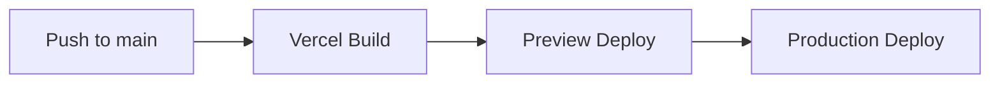

# 🏇 KRace - 한국 공영경주 정보 플랫폼

> **경마, 경륜, 경정 정보를 가장 빠르고 정확하게**

[](https://nextjs.org/)
[](https://www.typescriptlang.org/)
[](https://tailwindcss.com/)
[](https://opensource.org/licenses/ISC)

---

## 📋 목차

- [개요](#개요)
- [주요 기능](#주요-기능)
- [빠른 시작](#빠른-시작)
- [프로젝트 구조](#프로젝트-구조)
- [개발 가이드](#개발-가이드)
- [테스트](#테스트)
- [배포](#배포)
- [문서](#문서)
- [기여 방법](#기여-방법)
- [라이선스](#라이선스)

---

## 개요

**KRace**는 한국 공영경주(경마/경륜/경정) 정보를 실시간으로 제공하는 웹 서비스입니다.

### 핵심 가치

| 가치 | 설명 |
|------|------|
| 🏃 **빠름** | Next.js ISR 캐싱으로 즉시 로딩 |
| 📱 **편리함** | 모바일 최적화 반응형 UI |
| 🔒 **신뢰성** | KSPO 공식 API 기반 정확한 데이터 |
| 🎯 **통합** | 3개 종목을 한 곳에서 |

### 기술 스택

```
Frontend:  Next.js 14 (App Router) + React 18 + TypeScript 5.9
Styling:   Tailwind CSS 3.4
Testing:   Jest 30 + Playwright 1.56
Hosting:   Vercel + Cloudflare
```

---

## 주요 기능

### MVP (현재)

- ✅ **오늘의 경주 목록** - 경마/경륜/경정 탭별 조회
- ✅ **경주 상세 정보** - 출주표, 기수/선수 정보
- 🔄 **실시간 배당률** - 단승/복승/쌍승 배당
- 🔄 **경주 결과** - 착순, 배당금 확인
- ✅ **반응형 UI** - 모바일/태블릿/데스크톱 최적화
- ✅ **SEO 최적화** - sitemap, robots.txt, OG 태그

### Phase 2 (예정)

- ⏳ 결과 히스토리 검색
- ⏳ 관심 경주 알림
- ⏳ 기수/선수 통계 분석

---

## 빠른 시작

### 필수 조건

- **Node.js** 18.17 이상
- **npm** 9.0 이상 또는 **yarn** 1.22 이상

### 설치 및 실행

```bash
# 1. 저장소 클론
git clone https://github.com/Prometheus-P/racelab.git
cd racelab

# 2. 의존성 설치
npm install

# 3. 환경 변수 설정
cp .env.local.example .env.local
# .env.local 파일을 편집하여 API 키 입력

# 4. 개발 서버 실행
npm run dev
```

브라우저에서 [http://localhost:3000](http://localhost:3000) 접속

### 환경 변수 설정

```bash
# .env.local

# 필수 - 공공데이터포털 API 키
KRA_API_KEY=your_kra_api_key_here      # 한국마사회
KSPO_API_KEY=your_kspo_api_key_here    # 국민체육진흥공단

# 선택 - 프로덕션 설정
NEXT_PUBLIC_SITE_URL=https://krace.co.kr
NEXT_PUBLIC_GA_ID=G-XXXXXXXXXX
NEXT_PUBLIC_ADSENSE_ID=ca-pub-XXXXXXXXXX
```

> 📖 상세한 환경 설정은 [ENVIRONMENT.md](./ENVIRONMENT.md) 참조

---

## 프로젝트 구조

```
📦 racelab/
├── 📄 CONTEXT.md              # 프로젝트 컨텍스트 (필독)
├── 📄 README.md               # 이 문서
├── 📄 ENVIRONMENT.md          # 환경 설정 가이드
├── 📄 plan.md                 # TDD 개발 계획
│
├── 📁 docs/                   # 문서
│   ├── 📁 technical/          # 기술 문서
│   ├── 📁 business/           # 비즈니스 문서
│   └── 📁 operations/         # 운영 문서
│
├── 📁 src/                    # 소스 코드
│   ├── 📁 app/                # Next.js App Router
│   │   ├── page.tsx           # 홈페이지
│   │   ├── layout.tsx         # 루트 레이아웃
│   │   ├── 📁 race/[id]/      # 경주 상세
│   │   └── 📁 api/races/      # API 라우트
│   ├── 📁 components/         # React 컴포넌트
│   ├── 📁 lib/                # 유틸리티
│   └── 📁 types/              # TypeScript 타입
│
├── 📁 e2e/                    # E2E 테스트
│   ├── 📁 pages/              # Page Objects
│   └── 📁 tests/              # 테스트 스펙
│
└── 📁 .github/workflows/      # CI/CD
```

---

## 개발 가이드

### 사용 가능한 스크립트

| 명령어 | 설명 |
|--------|------|
| `npm run dev` | 개발 서버 실행 (localhost:3000) |
| `npm run build` | 프로덕션 빌드 |
| `npm start` | 프로덕션 서버 실행 |
| `npm run lint` | ESLint 검사 |
| `npm test` | Jest 단위 테스트 |
| `npm run test:e2e` | Playwright E2E 테스트 |

### TDD 개발 사이클

```
┌─────────┐     ┌─────────┐     ┌───────────┐
│   RED   │ ──▶ │  GREEN  │ ──▶ │ REFACTOR  │
│ (실패)  │     │ (통과)   │     │ (개선)    │
└─────────┘     └─────────┘     └───────────┘
```

1. **Red**: 실패하는 테스트 작성
2. **Green**: 테스트 통과를 위한 최소 코드 작성
3. **Refactor**: 코드 개선 (동작 유지)

> 📖 상세 TDD 규칙은 [docs/TDD_RULES.md](./docs/TDD_RULES.md) 참조

### 커밋 컨벤션

```
<type>(<scope>): <subject>
```

| Type | 설명 |
|------|------|
| `feat` | 새 기능 |
| `fix` | 버그 수정 |
| `refactor` | 리팩토링 |
| `test` | 테스트 추가/수정 |
| `docs` | 문서 변경 |
| `chore` | 빌드/설정 변경 |

**예시:**
```bash
git commit -m "feat(race): add odds display component"
git commit -m "fix(api): handle null response from KSPO"
git commit -m "test(components): add TodayRaces snapshot test"
```

---

## 테스트

### 단위 테스트 (Jest)

```bash
# 전체 테스트 실행
npm test

# 특정 파일 테스트
npm test -- src/components/Header.test.tsx

# 커버리지 리포트
npm test -- --coverage
```

### E2E 테스트 (Playwright)

```bash
# 전체 E2E 테스트
npm run test:e2e

# UI 모드로 실행
npm run test:e2e:ui

# 특정 테스트만 실행
npx playwright test e2e/tests/home.spec.ts
```

### 테스트 커버리지 목표

| 유형 | 목표 | 현재 |
|------|------|------|
| Unit | 80% | ~70% |
| Integration | 60% | ~50% |
| E2E (Critical) | 100% | ✅ |

---

## 배포

### Vercel 자동 배포



### 수동 배포

```bash
# 빌드
npm run build

# 빌드 결과 확인
npm start
```

### 환경별 URL

| 환경 | URL |
|------|-----|
| Production | https://krace.co.kr |
| Preview | https://racelab-*.vercel.app |
| Local | http://localhost:3000 |

---

## 문서

| 문서 | 설명 |
|------|------|
| [CONTEXT.md](./CONTEXT.md) | 프로젝트 전체 맥락 (필독) |
| [ENVIRONMENT.md](./ENVIRONMENT.md) | 환경 설정 상세 가이드 |
| [plan.md](./plan.md) | TDD 개발 계획 |
| [docs/TDD_RULES.md](./docs/TDD_RULES.md) | TDD 규칙 |
| [docs/technical/TECHNICAL_DESIGN.md](./docs/technical/TECHNICAL_DESIGN.md) | 시스템 아키텍처 |
| [docs/technical/API_SPECIFICATION.md](./docs/technical/API_SPECIFICATION.md) | API 명세 |
| [docs/technical/DEVELOPMENT_GUIDE.md](./docs/technical/DEVELOPMENT_GUIDE.md) | 개발 가이드 |

---

## 기여 방법

1. **이슈 생성**: 버그 리포트 또는 기능 제안
2. **Fork & Branch**: 기능별 브랜치 생성
3. **개발**: TDD 사이클 준수
4. **테스트**: 모든 테스트 통과 확인
5. **PR 생성**: 상세한 설명과 함께 제출

```bash
# 브랜치 생성
git checkout -b feature/add-new-feature

# 개발 후 커밋
git add .
git commit -m "feat(scope): add new feature"

# Push 및 PR 생성
git push origin feature/add-new-feature
```

---

## 라이선스

이 프로젝트는 [ISC License](LICENSE)를 따릅니다.

---

## 연락처

- **GitHub Issues**: [이슈 생성](https://github.com/Prometheus-P/racelab/issues)
- **Project Owner**: @Prometheus-P

---

<div align="center">

**Made with ❤️ for Korean Racing Fans**

</div>
