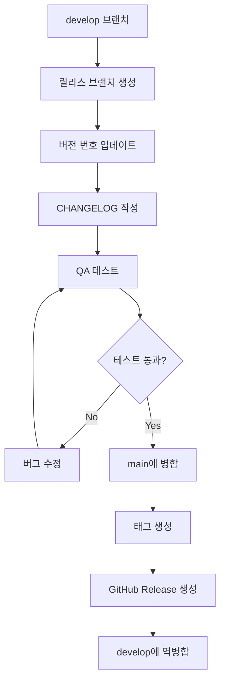

# VERSIONING_GUIDE.md - 버전 관리 가이드

> **이 문서는 Git을 사용한 버전 관리 규칙과 릴리스 전략을 안내합니다.**
> 일관된 버전 관리로 프로젝트의 이력을 명확하게 유지합니다.

---

## 변경 이력 (Changelog)

| 버전 | 날짜 | 작성자 | 변경 내용 |
|------|------|--------|----------|
| 1.0.0 | 2025-11-25 | @Prometheus-P | 최초 작성 |

## 관련 문서 (Related Documents)

- [CONTRIBUTING.md](./CONTRIBUTING.md) - 기여 가이드
- [CODE_REVIEW_GUIDE.md](./CODE_REVIEW_GUIDE.md) - 코드 리뷰 가이드
- [docs/operations/RELEASE_MANAGEMENT.md](./docs/operations/RELEASE_MANAGEMENT.md) - 릴리스 관리

---

## 📋 목차

1. [시맨틱 버저닝](#1-시맨틱-버저닝)
2. [Git 브랜치 전략](#2-git-브랜치-전략)
3. [커밋 컨벤션](#3-커밋-컨벤션)
4. [태그 관리](#4-태그-관리)
5. [릴리스 프로세스](#5-릴리스-프로세스)
6. [변경 로그 관리](#6-변경-로그-관리)
7. [롤백 절차](#7-롤백-절차)

---

## 1. 시맨틱 버저닝

### 1.1 버전 형식

```
MAJOR.MINOR.PATCH[-PRERELEASE][+BUILD]

예시: 1.2.3-beta.1+build.456
```

| 구성요소 | 설명 | 증가 조건 |
|----------|------|----------|
| **MAJOR** | 주 버전 | 하위 호환성 깨지는 변경 |
| **MINOR** | 부 버전 | 하위 호환 기능 추가 |
| **PATCH** | 패치 버전 | 하위 호환 버그 수정 |
| **PRERELEASE** | 프리릴리스 | alpha, beta, rc |
| **BUILD** | 빌드 메타데이터 | CI 빌드 번호 등 |

### 1.2 버전 증가 규칙

```
┌─────────────────────────────────────────────────────────────┐
│  📊 버전 증가 결정 트리                                      │
├─────────────────────────────────────────────────────────────┤
│                                                             │
│  Q1: API/인터페이스가 변경되어 기존 코드가 깨지나요?           │
│      │                                                      │
│      ├─ Yes → MAJOR 증가 (1.0.0 → 2.0.0)                   │
│      │                                                      │
│      └─ No → Q2로                                          │
│                                                             │
│  Q2: 새로운 기능이 추가되었나요?                             │
│      │                                                      │
│      ├─ Yes → MINOR 증가 (1.0.0 → 1.1.0)                   │
│      │                                                      │
│      └─ No → Q3로                                          │
│                                                             │
│  Q3: 버그 수정 또는 작은 개선인가요?                         │
│      │                                                      │
│      └─ Yes → PATCH 증가 (1.0.0 → 1.0.1)                   │
│                                                             │
└─────────────────────────────────────────────────────────────┘
```

### 1.3 버전 예시

| 변경 유형 | 이전 | 이후 | 설명 |
|----------|------|------|------|
| 버그 수정 | 1.2.3 | 1.2.4 | API 응답 null 처리 |
| 기능 추가 | 1.2.3 | 1.3.0 | 배당률 표시 기능 |
| API 변경 | 1.2.3 | 2.0.0 | 응답 형식 전면 변경 |
| 베타 릴리스 | 1.2.3 | 1.3.0-beta.1 | 새 기능 베타 테스트 |

### 1.4 0.x.x 버전 (초기 개발)

```
0.x.x 버전 규칙:
━━━━━━━━━━━━━━━━━━━━━━━━━━━━━━━━━━━━━━━━━━━━━━━━━

• 0.x.x는 초기 개발 단계를 의미
• 언제든 API가 변경될 수 있음
• MINOR 증가 = 기능 추가 또는 breaking change
• 1.0.0 릴리스 = 프로덕션 준비 완료 선언
```

---

## 2. Git 브랜치 전략

### 2.1 브랜치 구조

```
┌─────────────────────────────────────────────────────────────┐
│                        main (production)                     │
│  ════════════════════════════════════════════════════════   │
│         │                    │                    │          │
│         │                    │                    │          │
│  ───────┼────────────────────┼────────────────────┼───────   │
│         │                    │                    │          │
│         ▼                    ▼                    ▼          │
│      v1.0.0               v1.1.0               v1.2.0       │
│                                                             │
├─────────────────────────────────────────────────────────────┤
│                        develop                               │
│  ════════════════════════════════════════════════════════   │
│      │         │         │         │         │              │
│      │         │         │         │         │              │
│  ────┼─────────┼─────────┼─────────┼─────────┼───────────   │
│      │         │         │         │         │              │
│      ▼         ▼         ▼         ▼         ▼              │
│   feature/  feature/  fix/     feature/  refactor/          │
│   add-odds  new-ui    api-bug  alerts   cleanup            │
│                                                             │
└─────────────────────────────────────────────────────────────┘
```

### 2.2 브랜치 유형

| 브랜치 | 목적 | 생성 위치 | 병합 대상 | 수명 |
|--------|------|----------|----------|------|
| `main` | 프로덕션 | - | - | 영구 |
| `develop` | 개발 통합 | main | main | 영구 |
| `feature/*` | 기능 개발 | develop | develop | 임시 |
| `fix/*` | 버그 수정 | develop | develop | 임시 |
| `hotfix/*` | 긴급 수정 | main | main, develop | 임시 |
| `release/*` | 릴리스 준비 | develop | main, develop | 임시 |

### 2.3 브랜치 명명 규칙

```bash
# 형식
<type>/<issue-number>-<short-description>

# 예시
feature/123-add-odds-display      # 기능 추가
fix/456-null-pointer-exception    # 버그 수정
hotfix/789-production-api-error   # 긴급 수정
release/1.2.0                     # 릴리스 준비
refactor/012-extract-api-client   # 리팩토링
docs/345-update-readme            # 문서 수정
```

### 2.4 브랜치 워크플로우

**Feature 개발**

```bash
# 1. develop에서 feature 브랜치 생성
git checkout develop
git pull origin develop
git checkout -b feature/123-add-odds-display

# 2. 개발 및 커밋
git add .
git commit -m "feat(race): add odds display component"

# 3. develop에 PR 생성
git push origin feature/123-add-odds-display
# GitHub에서 PR 생성 → 리뷰 → Merge
```

**Hotfix 처리**

```bash
# 1. main에서 hotfix 브랜치 생성
git checkout main
git pull origin main
git checkout -b hotfix/789-production-api-error

# 2. 수정 및 커밋
git add .
git commit -m "fix(api): resolve production 500 error"

# 3. main과 develop 모두에 병합
# main에 PR → Merge
# develop에도 cherry-pick 또는 병합
```

---

## 3. 커밋 컨벤션

### 3.1 커밋 메시지 형식

```
<type>(<scope>): <subject>

[optional body]

[optional footer]
```

### 3.2 Type 정의

| Type | 버전 영향 | 설명 |
|------|----------|------|
| `feat` | MINOR | 새로운 기능 추가 |
| `fix` | PATCH | 버그 수정 |
| `docs` | - | 문서 변경 |
| `style` | - | 코드 스타일 (포맷팅) |
| `refactor` | - | 리팩토링 |
| `perf` | PATCH | 성능 개선 |
| `test` | - | 테스트 추가/수정 |
| `chore` | - | 빌드/설정 변경 |
| `ci` | - | CI 설정 변경 |
| `revert` | varies | 이전 커밋 되돌리기 |

### 3.3 Breaking Change 표시

```bash
# Footer에 BREAKING CHANGE 명시
git commit -m "$(cat <<'EOF'
feat(api): change response format to JSON:API spec

BREAKING CHANGE: API 응답 형식이 변경되었습니다.
기존 클라이언트는 새 형식에 맞게 업데이트가 필요합니다.

Before:
{ "races": [...] }

After:
{ "data": [...], "meta": {...} }
EOF
)"
```

### 3.4 커밋 분리 원칙

```
┌─────────────────────────────────────────────────────────────┐
│  ⚠️ Tidy와 Behavior를 절대 섞지 마세요!                      │
├─────────────────────────────────────────────────────────────┤
│                                                             │
│  Tidy (구조적 변경):                                         │
│  • 리팩토링                                                  │
│  • 포맷팅                                                    │
│  • 변수명 변경                                               │
│  • 파일 이동                                                 │
│                                                             │
│  Behavior (동작 변경):                                       │
│  • 기능 추가                                                 │
│  • 버그 수정                                                 │
│  • 로직 변경                                                 │
│                                                             │
│  ✅ 올바른 예:                                               │
│  1. "refactor(api): extract response mapper"                │
│  2. "feat(api): add odds endpoint using new mapper"         │
│                                                             │
│  ❌ 잘못된 예:                                               │
│  1. "feat(api): add odds endpoint and refactor mapper"      │
│                                                             │
└─────────────────────────────────────────────────────────────┘
```

---

## 4. 태그 관리

### 4.1 태그 명명 규칙

```bash
# 릴리스 태그
v1.0.0
v1.1.0-beta.1
v2.0.0-rc.1

# 형식
v<MAJOR>.<MINOR>.<PATCH>[-<prerelease>]
```

### 4.2 태그 생성

```bash
# Annotated 태그 생성 (권장)
git tag -a v1.2.0 -m "Release version 1.2.0

Features:
- 실시간 배당률 표시 기능 추가
- 경주 결과 조회 기능 추가

Bug Fixes:
- API 타임아웃 이슈 수정
- 모바일 레이아웃 버그 수정
"

# 태그 푸시
git push origin v1.2.0

# 모든 태그 푸시
git push origin --tags
```

### 4.3 태그 조회

```bash
# 모든 태그 목록
git tag

# 특정 패턴 태그
git tag -l "v1.*"

# 태그 상세 정보
git show v1.2.0

# 태그 기반 체크아웃
git checkout v1.2.0
```

### 4.4 태그 삭제 (주의)

```bash
# 로컬 태그 삭제
git tag -d v1.2.0

# 원격 태그 삭제 (신중히!)
git push origin --delete v1.2.0
```

---

## 5. 릴리스 프로세스

### 5.1 릴리스 플로우



### 5.2 릴리스 단계별 가이드

**1단계: 릴리스 브랜치 생성**

```bash
# develop에서 릴리스 브랜치 생성
git checkout develop
git pull origin develop
git checkout -b release/1.2.0
```

**2단계: 버전 업데이트**

```bash
# package.json 버전 업데이트
npm version 1.2.0 --no-git-tag-version

# 또는 수동으로 package.json 수정
{
  "version": "1.2.0"
}
```

**3단계: CHANGELOG 작성**

```markdown
# CHANGELOG.md에 추가

## [1.2.0] - 2025-11-25

### Added
- 실시간 배당률 표시 기능 (#123)
- 경주 결과 조회 기능 (#124)

### Changed
- API 응답 캐싱 전략 개선 (#125)

### Fixed
- API 타임아웃 이슈 수정 (#126)
- 모바일 레이아웃 버그 수정 (#127)
```

**4단계: 최종 테스트 및 병합**

```bash
# 테스트 실행
npm test
npm run build

# main에 PR 생성 및 병합
git push origin release/1.2.0
# GitHub에서 PR → main 병합
```

**5단계: 태그 및 릴리스**

```bash
# main에서 태그 생성
git checkout main
git pull origin main
git tag -a v1.2.0 -m "Release v1.2.0"
git push origin v1.2.0

# GitHub Releases에서 릴리스 노트 작성
```

**6단계: develop 동기화**

```bash
# main 변경사항을 develop에 반영
git checkout develop
git merge main
git push origin develop
```

### 5.3 릴리스 체크리스트

```markdown
## 릴리스 전 체크리스트

### 코드
- [ ] 모든 테스트 통과
- [ ] 빌드 성공
- [ ] 린트 검사 통과
- [ ] 보안 취약점 스캔 통과

### 문서
- [ ] CHANGELOG.md 업데이트
- [ ] README.md 업데이트 (필요시)
- [ ] API 문서 업데이트 (필요시)
- [ ] 버전 번호 업데이트

### 배포
- [ ] 스테이징 환경 테스트
- [ ] 롤백 계획 준비
- [ ] 모니터링 알림 설정
- [ ] 팀 공지

### 릴리스 후
- [ ] 프로덕션 모니터링
- [ ] GitHub Release 발행
- [ ] 릴리스 공지
```

---

## 6. 변경 로그 관리

### 6.1 CHANGELOG.md 형식

```markdown
# Changelog

All notable changes to this project will be documented in this file.

The format is based on [Keep a Changelog](https://keepachangelog.com/ko/1.0.0/),
and this project adheres to [Semantic Versioning](https://semver.org/spec/v2.0.0.html).

## [Unreleased]

### Added
- 새로운 기능 목록

### Changed
- 변경된 기능 목록

### Deprecated
- 곧 삭제될 기능

### Removed
- 삭제된 기능

### Fixed
- 버그 수정

### Security
- 보안 관련 수정

## [1.2.0] - 2025-11-25

### Added
- 실시간 배당률 표시 기능 추가 (#123)
- 경주 결과 조회 기능 추가 (#124)

### Fixed
- API 응답 null 처리 버그 수정 (#126)

## [1.1.0] - 2025-11-20

### Added
- 경주 상세 페이지 추가 (#100)
- 출주표 조회 기능 추가 (#101)

## [1.0.0] - 2025-11-15

### Added
- 초기 릴리스
- 경마/경륜/경정 목록 조회
- 기본 UI 구현
```

### 6.2 변경 로그 작성 원칙

```
┌─────────────────────────────────────────────────────────────┐
│  📝 변경 로그 작성 가이드                                    │
├─────────────────────────────────────────────────────────────┤
│                                                             │
│  1. 사용자 관점으로 작성                                     │
│     ❌ "리팩토링 완료"                                       │
│     ✅ "페이지 로딩 속도 30% 개선"                           │
│                                                             │
│  2. 구체적으로 작성                                          │
│     ❌ "버그 수정"                                           │
│     ✅ "모바일에서 탭 전환 시 화면 깜빡임 수정"              │
│                                                             │
│  3. 이슈/PR 번호 참조                                        │
│     ✅ "배당률 표시 기능 추가 (#123)"                        │
│                                                             │
│  4. 카테고리 적절히 분류                                     │
│     Added / Changed / Deprecated / Removed / Fixed / Security│
│                                                             │
└─────────────────────────────────────────────────────────────┘
```

---

## 7. 롤백 절차

### 7.1 롤백 시나리오

| 상황 | 롤백 방법 |
|------|----------|
| 배포 직후 문제 발견 | 이전 버전 재배포 |
| 커밋 수준 문제 | git revert |
| 긴급 데이터 문제 | 데이터 복구 + 코드 수정 |

### 7.2 Git Revert

```bash
# 특정 커밋 되돌리기
git revert <commit-hash>

# 여러 커밋 되돌리기
git revert <oldest-commit>..<newest-commit>

# 머지 커밋 되돌리기
git revert -m 1 <merge-commit-hash>
```

### 7.3 Vercel 롤백

```bash
# Vercel CLI로 이전 배포로 롤백
vercel rollback

# 특정 배포로 롤백
vercel rollback <deployment-url>

# 또는 Vercel 대시보드에서
# Deployments → 이전 배포 선택 → Promote to Production
```

### 7.4 롤백 체크리스트

```markdown
## 롤백 실행 체크리스트

### 롤백 전
- [ ] 문제 상황 문서화
- [ ] 영향 범위 파악
- [ ] 롤백 대상 버전 확인
- [ ] 팀 공지

### 롤백 실행
- [ ] 이전 버전 배포/revert
- [ ] 배포 상태 확인
- [ ] 기능 테스트
- [ ] 모니터링 확인

### 롤백 후
- [ ] 문제 원인 분석
- [ ] 포스트모템 작성
- [ ] 재발 방지 대책 수립
- [ ] 수정 후 재배포 계획
```

---

## 📋 빠른 참조

### 버전 증가 요약

```
버그 수정      → PATCH (1.0.0 → 1.0.1)
기능 추가      → MINOR (1.0.0 → 1.1.0)
호환성 깨짐    → MAJOR (1.0.0 → 2.0.0)
```

### 브랜치 명명

```
feature/123-description    # 기능
fix/123-description        # 버그 수정
hotfix/123-description     # 긴급 수정
release/1.2.0              # 릴리스
```

### 태그 명명

```
v1.0.0                     # 정식 릴리스
v1.1.0-beta.1              # 베타
v2.0.0-rc.1                # 릴리스 후보
```

### 자주 사용하는 명령어

```bash
# 버전 확인
git describe --tags

# 태그 생성
git tag -a v1.2.0 -m "Release v1.2.0"

# 태그 푸시
git push origin v1.2.0

# 특정 태그로 체크아웃
git checkout v1.2.0

# 롤백
git revert <commit-hash>
```

---

*일관된 버전 관리는 프로젝트의 신뢰성을 높입니다.* 🏷️
