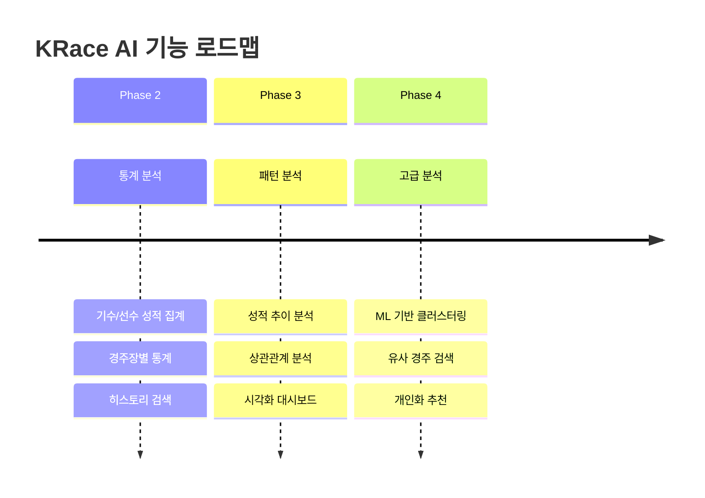

# AI_PIPELINE_DESIGN.md - AI 파이프라인 설계

> **이 문서는 KRace의 향후 AI/ML 기능을 위한 파이프라인 설계를 정의합니다.**
> Phase 3에서 구현 예정인 AI 기반 분석 및 데이터 인사이트 기능의 아키텍처를 다룹니다.

---

## 변경 이력 (Changelog)

| 버전  | 날짜       | 작성자        | 변경 내용             |
| ----- | ---------- | ------------- | --------------------- |
| 1.0.0 | 2025-11-25 | @Prometheus-P | 최초 작성 (설계 초안) |

## 관련 문서 (Related Documents)

- [ARCHITECTURE.md](./ARCHITECTURE.md) - 시스템 아키텍처
- [PRD.md](./PRD.md) - 제품 요구사항
- [DATA_MODEL.md](./DATA_MODEL.md) - 데이터 모델

---

## 📋 목차

1. [개요](#1-개요)
2. [AI 기능 로드맵](#2-ai-기능-로드맵)
3. [데이터 파이프라인](#3-데이터-파이프라인)
4. [모델 아키텍처](#4-모델-아키텍처)
5. [인프라 설계](#5-인프라-설계)
6. [윤리적 고려사항](#6-윤리적-고려사항)

---

## 1. 개요

### 1.1 문서 상태

```
⚠️ 이 문서는 Phase 3 (향후 계획) 설계 문서입니다.
   현재 MVP 단계에서는 AI 기능이 구현되지 않습니다.
```

### 1.2 AI 기능 비전

```
┌─────────────────────────────────────────────────────────────┐
│  🤖 KRace AI 비전                                           │
├─────────────────────────────────────────────────────────────┤
│                                                             │
│  "데이터 기반의 객관적인 경주 분석 정보를 제공하여           │
│   사용자가 더 나은 의사결정을 할 수 있도록 지원"             │
│                                                             │
│  핵심 원칙:                                                  │
│  • 정보 제공 목적 (베팅 조언 아님)                           │
│  • 투명한 모델 설명                                          │
│  • 책임감 있는 AI 사용                                       │
│                                                             │
└─────────────────────────────────────────────────────────────┘
```

### 1.3 범위 정의

**In-Scope (포함)**

- 기수/선수 성적 분석
- 경주 패턴 분석
- 통계 기반 인사이트

**Out-of-Scope (제외)**

- 베팅 추천/조언
- 승률 분석 표현 (법적 이슈)
- 실시간 AI 추론 (비용)

---

## 2. AI 기능 로드맵

### 2.1 Phase별 계획



### 2.2 기능 상세

#### Phase 2: 통계 분석 (기초)

| 기능          | 설명                  | 기술      |
| ------------- | --------------------- | --------- |
| 기수 성적표   | 최근 N경주 성적, 승률 | SQL 집계  |
| 경주장 통계   | 거리별, 등급별 통계   | SQL 집계  |
| 히스토리 검색 | 과거 경주 결과 검색   | 전문 검색 |

#### Phase 3: 패턴 분석 (중급)

| 기능      | 설명                 | 기술        |
| --------- | -------------------- | ----------- |
| 성적 추이 | 시계열 성적 변화     | 시계열 분석 |
| 상관 분석 | 조건별 성적 상관관계 | 통계 분석   |
| 대시보드  | 인터랙티브 차트      | Chart.js    |

#### Phase 4: 고급 분석 (고급)

| 기능       | 설명                  | 기술          |
| ---------- | --------------------- | ------------- |
| 클러스터링 | 유사 기수/선수 그룹화 | K-means       |
| 유사 경주  | 과거 유사 경주 검색   | 코사인 유사도 |
| 개인화     | 관심 경주 추천        | 협업 필터링   |

---

## 3. 데이터 파이프라인

### 3.1 데이터 흐름

```
┌─────────────────────────────────────────────────────────────┐
│  📊 데이터 파이프라인                                        │
├─────────────────────────────────────────────────────────────┤
│                                                             │
│  ┌──────────┐     ┌──────────┐     ┌──────────┐            │
│  │  Source  │────▶│  Ingest  │────▶│  Store   │            │
│  │  (APIs)  │     │  (ETL)   │     │  (DB)    │            │
│  └──────────┘     └──────────┘     └──────────┘            │
│       │                                  │                  │
│       │                                  ▼                  │
│       │               ┌──────────────────────┐             │
│       │               │      Transform       │             │
│       │               │   (Feature Eng.)     │             │
│       │               └──────────┬───────────┘             │
│       │                          │                         │
│       │                          ▼                         │
│       │               ┌──────────────────────┐             │
│       │               │       Analyze        │             │
│       │               │    (Statistics)      │             │
│       │               └──────────┬───────────┘             │
│       │                          │                         │
│       │                          ▼                         │
│       │               ┌──────────────────────┐             │
│       │               │       Serve          │             │
│       │               │    (API / UI)        │             │
│       └───────────────┴──────────────────────┘             │
│                                                             │
└─────────────────────────────────────────────────────────────┘
```

### 3.2 데이터 수집 (Ingestion)

```typescript
// 향후 구현 예정: 데이터 수집 스케줄러

interface DataIngestionConfig {
  // 수집 소스
  sources: {
    kspo: {
      races: '경주 목록';
      entries: '출주 정보';
      results: '경주 결과';
    };
    kra: {
      races: '경마 경주';
      entries: '경마 출주';
      results: '경마 결과';
    };
  };

  // 수집 주기
  schedule: {
    races: 'every 30 minutes'; // 경주 목록
    results: 'after race finished'; // 결과
    daily: '매일 자정'; // 일간 집계
  };

  // 저장소
  storage: {
    raw: 'S3 / Blob Storage'; // 원본 데이터
    processed: 'PostgreSQL'; // 가공 데이터
    analytics: 'ClickHouse'; // 분석용 (선택)
  };
}
```

### 3.3 데이터 저장 스키마

```sql
-- 향후 구현 예정: 데이터베이스 스키마

-- 경주 테이블
CREATE TABLE races (
    id VARCHAR(50) PRIMARY KEY,
    type VARCHAR(10) NOT NULL,
    race_date DATE NOT NULL,
    venue VARCHAR(20) NOT NULL,
    race_number INT NOT NULL,
    distance INT,
    class VARCHAR(20),
    status VARCHAR(20),
    created_at TIMESTAMP DEFAULT NOW(),

    INDEX idx_race_date (race_date),
    INDEX idx_venue_date (venue, race_date)
);

-- 출주 테이블
CREATE TABLE entries (
    id SERIAL PRIMARY KEY,
    race_id VARCHAR(50) REFERENCES races(id),
    entry_number INT NOT NULL,
    name VARCHAR(100) NOT NULL,
    jockey_name VARCHAR(50),
    weight DECIMAL(5,2),
    created_at TIMESTAMP DEFAULT NOW(),

    UNIQUE(race_id, entry_number)
);

-- 결과 테이블
CREATE TABLE results (
    id SERIAL PRIMARY KEY,
    race_id VARCHAR(50) REFERENCES races(id),
    entry_number INT NOT NULL,
    rank INT,
    time VARCHAR(20),
    payout_win INT,
    payout_place INT,
    created_at TIMESTAMP DEFAULT NOW(),

    UNIQUE(race_id, entry_number)
);

-- 기수/선수 통계 뷰
CREATE VIEW jockey_stats AS
SELECT
    e.jockey_name,
    COUNT(*) as total_races,
    SUM(CASE WHEN r.rank = 1 THEN 1 ELSE 0 END) as wins,
    ROUND(100.0 * SUM(CASE WHEN r.rank = 1 THEN 1 ELSE 0 END) / COUNT(*), 2) as win_rate,
    ROUND(100.0 * SUM(CASE WHEN r.rank <= 3 THEN 1 ELSE 0 END) / COUNT(*), 2) as top3_rate
FROM entries e
JOIN results r ON e.race_id = r.race_id AND e.entry_number = r.entry_number
GROUP BY e.jockey_name;
```

### 3.4 특성 엔지니어링

```typescript
// 향후 구현 예정: Feature Engineering

interface RaceFeatures {
  // 기수/선수 특성
  jockey: {
    recentWinRate: number; // 최근 30일 승률
    venueWinRate: number; // 해당 경주장 승률
    distanceWinRate: number; // 해당 거리 승률
    classWinRate: number; // 해당 등급 승률
    currentStreak: number; // 연속 성적 (양수: 연승, 음수: 연패)
  };

  // 경주 조건 특성
  race: {
    distanceCategory: 'short' | 'middle' | 'long';
    classLevel: number; // 등급 숫자화
    fieldSize: number; // 출주 수
    timeOfDay: 'morning' | 'afternoon' | 'evening';
  };

  // 과거 데이터 특성
  historical: {
    avgFinishPosition: number; // 평균 착순
    stdFinishPosition: number; // 착순 표준편차
    daysFromLastRace: number; // 최근 경주로부터 일수
  };
}

/**
 * 특성 계산 함수
 */
function calculateFeatures(jockeyId: string, raceContext: RaceContext): RaceFeatures {
  // 구현 예정
  return {} as RaceFeatures;
}
```

---

## 4. 모델 아키텍처

### 4.1 분석 모델 (Phase 3)

```
┌─────────────────────────────────────────────────────────────┐
│  📈 통계 분석 모델                                           │
├─────────────────────────────────────────────────────────────┤
│                                                             │
│  Model 1: 성적 추이 분석                                    │
│  ─────────────────────────────────────────────              │
│  • 입력: 시계열 성적 데이터                                  │
│  • 출력: 추이 (상승/하락/유지), 변동성                       │
│  • 기법: 이동 평균, 선형 회귀                                │
│                                                             │
│  Model 2: 상관 분석                                         │
│  ─────────────────────────────────────────────              │
│  • 입력: 경주 조건, 성적                                     │
│  • 출력: 조건별 성적 상관관계                                │
│  • 기법: 피어슨 상관계수, 카이제곱 검정                      │
│                                                             │
│  Model 3: 이상치 탐지                                       │
│  ─────────────────────────────────────────────              │
│  • 입력: 배당률, 성적 데이터                                 │
│  • 출력: 특이 패턴 플래그                                    │
│  • 기법: IQR, Z-score                                       │
│                                                             │
└─────────────────────────────────────────────────────────────┘
```

### 4.2 ML 모델 (Phase 4)

```
┌─────────────────────────────────────────────────────────────┐
│  🤖 ML 모델 (Phase 4)                                       │
├─────────────────────────────────────────────────────────────┤
│                                                             │
│  Model: 기수/선수 클러스터링                                 │
│  ─────────────────────────────────────────────              │
│  • 목적: 유사한 성격의 기수/선수 그룹화                      │
│  • 알고리즘: K-means, DBSCAN                                │
│  • 특성: 승률, 선호 거리, 성적 변동성                        │
│                                                             │
│  ┌─────────────────────────────────────────────┐            │
│  │  Cluster 1: "단거리 전문가"                  │            │
│  │  Cluster 2: "장거리 안정형"                  │            │
│  │  Cluster 3: "올라운더"                       │            │
│  │  Cluster 4: "신예/성장형"                    │            │
│  └─────────────────────────────────────────────┘            │
│                                                             │
│  Model: 유사 경주 검색                                      │
│  ─────────────────────────────────────────────              │
│  • 목적: 과거 유사 조건 경주 검색                            │
│  • 알고리즘: 코사인 유사도, KNN                             │
│  • 특성: 거리, 등급, 출주 수, 날씨                           │
│                                                             │
└─────────────────────────────────────────────────────────────┘
```

### 4.3 모델 구현 예시 (개념)

```python
# 향후 구현 예정: Python ML 코드 (개념)

import pandas as pd
from sklearn.cluster import KMeans
from sklearn.preprocessing import StandardScaler

class JockeyClusterModel:
    """기수 클러스터링 모델"""

    def __init__(self, n_clusters=4):
        self.n_clusters = n_clusters
        self.scaler = StandardScaler()
        self.model = KMeans(n_clusters=n_clusters, random_state=42)

    def prepare_features(self, df: pd.DataFrame) -> pd.DataFrame:
        """특성 준비"""
        features = df[[
            'win_rate',           # 승률
            'avg_distance',       # 평균 경주 거리
            'finish_std',         # 착순 표준편차
            'race_frequency',     # 경주 빈도
        ]].copy()

        return features

    def fit(self, df: pd.DataFrame):
        """모델 학습"""
        features = self.prepare_features(df)
        scaled_features = self.scaler.fit_transform(features)
        self.model.fit(scaled_features)

        return self

    def predict(self, df: pd.DataFrame) -> list:
        """클러스터 분석 인사이트"""
        features = self.prepare_features(df)
        scaled_features = self.scaler.transform(features)

        return self.model.predict(scaled_features)

    def get_cluster_profiles(self) -> dict:
        """클러스터 프로파일"""
        # 클러스터 중심점 기반 프로파일 생성
        return {
            0: "단거리 전문가",
            1: "장거리 안정형",
            2: "올라운더",
            3: "신예/성장형",
        }
```

---

## 5. 인프라 설계

### 5.1 아키텍처 옵션

```
┌─────────────────────────────────────────────────────────────┐
│  🏗️ AI 인프라 옵션                                          │
├─────────────────────────────────────────────────────────────┤
│                                                             │
│  Option A: 서버리스 (권장 - 초기)                           │
│  ─────────────────────────────────────────────              │
│  • 장점: 비용 효율, 관리 용이                               │
│  • 단점: 콜드 스타트, 제한된 실행 시간                       │
│  • 적용: 통계 분석, 배치 처리                               │
│                                                             │
│  ┌──────────┐    ┌──────────┐    ┌──────────┐              │
│  │ Vercel   │───▶│  Lambda  │───▶│   S3     │              │
│  │ Cron     │    │  (분석)  │    │ (결과)   │              │
│  └──────────┘    └──────────┘    └──────────┘              │
│                                                             │
│                                                             │
│  Option B: 컨테이너 (Phase 4+)                              │
│  ─────────────────────────────────────────────              │
│  • 장점: 유연성, ML 라이브러리 자유                         │
│  • 단점: 비용 증가, 운영 복잡                               │
│  • 적용: ML 모델 학습, 복잡한 분석                          │
│                                                             │
│  ┌──────────┐    ┌──────────┐    ┌──────────┐              │
│  │ Cloud    │───▶│   ECS/   │───▶│  RDS/    │              │
│  │ Scheduler│    │  GKE     │    │ BigQuery │              │
│  └──────────┘    └──────────┘    └──────────┘              │
│                                                             │
└─────────────────────────────────────────────────────────────┘
```

### 5.2 비용 추정

| 구성요소 | Option A (서버리스) | Option B (컨테이너) |
| -------- | ------------------- | ------------------- |
| 컴퓨팅   | $10-30/월           | $50-100/월          |
| 스토리지 | $5-10/월            | $20-30/월           |
| DB       | $0-15/월            | $30-50/월           |
| **총합** | **$15-55/월**       | **$100-180/월**     |

### 5.3 추천 기술 스택

| 레이어      | 기술                         | 대안            |
| ----------- | ---------------------------- | --------------- |
| 스케줄링    | Vercel Cron / GitHub Actions | AWS EventBridge |
| 분석        | Vercel Functions / Lambda    | Cloud Functions |
| 데이터 저장 | Vercel Postgres / Supabase   | PlanetScale     |
| ML (선택)   | Python Lambda Layer          | SageMaker       |
| 시각화      | Chart.js / Recharts          | D3.js           |

---

## 6. 윤리적 고려사항

### 6.1 책임감 있는 AI 원칙

```
┌─────────────────────────────────────────────────────────────┐
│  ⚖️ 윤리적 AI 원칙                                          │
├─────────────────────────────────────────────────────────────┤
│                                                             │
│  1. 투명성 (Transparency)                                   │
│     • 분석 방법론 공개                                      │
│     • 데이터 출처 명시                                      │
│     • 한계점 명확히 고지                                    │
│                                                             │
│  2. 책임성 (Accountability)                                 │
│     • "정보 제공" 목적 명시                                 │
│     • "분석/추천" 기능 없음 명시                            │
│     • 면책 조항 표시                                        │
│                                                             │
│  3. 공정성 (Fairness)                                       │
│     • 편향 없는 데이터 사용                                 │
│     • 동등한 정보 접근성                                    │
│     • 특정 결과 유도 금지                                   │
│                                                             │
│  4. 개인정보 보호 (Privacy)                                 │
│     • 개인 식별 정보 미수집                                 │
│     • 데이터 익명화                                         │
│     • 최소 데이터 원칙                                      │
│                                                             │
└─────────────────────────────────────────────────────────────┘
```

### 6.2 법적 고려사항

| 항목        | 현황           | 대응                |
| ----------- | -------------- | ------------------- |
| 베팅 조언   | 법적 제한      | "분석 정보" 만 제공 |
| 분석 서비스 | 규제 대상 가능 | 승률 데이터 인사이트 제공 |
| 데이터 사용 | 공공데이터     | 이용 약관 준수      |

### 6.3 사용자 고지

```markdown
## 서비스 고지 (UI에 표시)

본 서비스에서 제공하는 분석 정보는 참고 목적으로만 제공됩니다.

• 이 정보는 베팅 조언이나 추천이 아닙니다.
• 과거 데이터 분석이 미래 결과를 보장하지 않습니다.
• 모든 결정은 사용자 본인의 책임입니다.
• 도박 관련 문제가 있다면 전문 상담을 받으세요.

상담 전화: 1336 (한국도박문제관리센터)
```

---

## 📋 부록

### A. 용어 정의

| 용어                | 정의                               |
| ------------------- | ---------------------------------- |
| Feature Engineering | 원시 데이터에서 유의미한 특성 추출 |
| Clustering          | 유사한 데이터 그룹화               |
| 시계열 분석         | 시간에 따른 데이터 패턴 분석       |
| 코사인 유사도       | 벡터 간 유사도 측정 방법           |

### B. 참고 자료

- [scikit-learn 문서](https://scikit-learn.org/)
- [Vercel AI SDK](https://sdk.vercel.ai/)
- [책임감 있는 AI 가이드라인](https://www.microsoft.com/en-us/ai/responsible-ai)

### C. 구현 우선순위

```
Phase 2 (기초 통계)
├── 1. 데이터베이스 설정
├── 2. 데이터 수집 스케줄러
├── 3. 기수 통계 API
└── 4. 통계 UI 컴포넌트

Phase 3 (패턴 분석)
├── 1. 특성 엔지니어링
├── 2. 시계열 분석
├── 3. 시각화 대시보드
└── 4. 상관 분석 기능

Phase 4 (ML)
├── 1. 클러스터링 모델
├── 2. 유사 경주 검색
├── 3. 개인화 추천
└── 4. 모델 모니터링
```

---

_이 문서는 AI 기능 개발 시 업데이트됩니다._
_현재 상태: 설계 초안 (Draft)_
