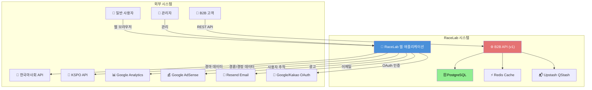
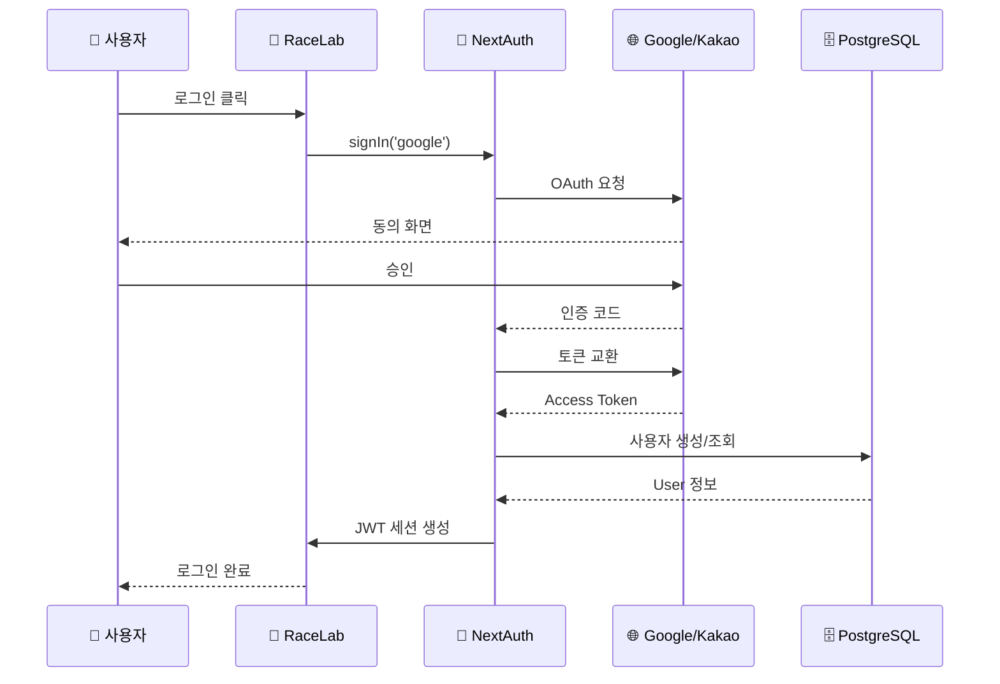
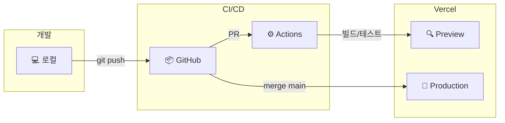

# ARCHITECTURE.md - 시스템 아키텍처

> **이 문서는 RaceLab 시스템의 전체 아키텍처를 정의합니다.**
> 시스템 설계의 근거와 주요 결정 사항을 포함합니다.

---

## 변경 이력 (Changelog)

| 버전  | 날짜       | 작성자        | 변경 내용 |
| ----- | ---------- | ------------- | --------- |
| 2.0.0 | 2025-12-28 | @Prometheus-P | DB, Auth, B2B API, Email, AdSense 추가 |
| 1.0.0 | 2025-11-25 | @Prometheus-P | 최초 작성 |

## 관련 문서 (Related Documents)

- [CONTEXT.md](../../CONTEXT.md) - 프로젝트 컨텍스트
- [CLAUDE.md](../../CLAUDE.md) - 개발 가이드라인
- [PRD.md](./PRD.md) - 제품 요구사항
- [API_SPEC.md](./API_SPEC.md) - API 명세
- [DATA_MODEL.md](./DATA_MODEL.md) - 데이터 모델

---

## 📋 목차

1. [아키텍처 개요](#1-아키텍처-개요)
2. [시스템 컨텍스트](#2-시스템-컨텍스트)
3. [디렉토리 구조](#3-디렉토리-구조)
4. [데이터 흐름](#4-데이터-흐름)
5. [기술 스택](#5-기술-스택)
6. [인증 아키텍처](#6-인증-아키텍처)
7. [B2B API 아키텍처](#7-b2b-api-아키텍처)
8. [데이터베이스 설계](#8-데이터베이스-설계)
9. [보안 아키텍처](#9-보안-아키텍처)
10. [배포 아키텍처](#10-배포-아키텍처)
11. [아키텍처 결정 기록](#11-아키텍처-결정-기록)

---

## 1. 아키텍처 개요

### 1.1 아키텍처 원칙

```
┌─────────────────────────────────────────────────────────────┐
│  🏛️ 아키텍처 원칙                                           │
├─────────────────────────────────────────────────────────────┤
│                                                             │
│  1. 단순성 (Simplicity)                                     │
│     • 복잡성 최소화, 이해하기 쉬운 구조                       │
│     • 불필요한 추상화 지양                                   │
│                                                             │
│  2. 성능 우선 (Performance First)                           │
│     • 사용자 경험에 직접 영향                                │
│     • ISR, 캐싱, 스트리밍 응답 적극 활용                     │
│                                                             │
│  3. 확장 가능성 (Scalability)                               │
│     • 수평 확장 가능한 설계                                  │
│     • 서버리스 + B2B Tier 시스템                            │
│                                                             │
│  4. 관심사 분리 (Separation of Concerns)                    │
│     • API Client → Mapper → Service → Route → Component    │
│     • 각 레이어의 명확한 책임                                │
│                                                             │
│  5. 타입 안전성 (Type Safety)                               │
│     • TypeScript strict mode                                │
│     • Drizzle ORM (SQL 타입 추론)                           │
│     • Zod 스키마 검증                                        │
│                                                             │
└─────────────────────────────────────────────────────────────┘
```

### 1.2 아키텍처 스타일

**선택: 모놀리식 + 서버리스 하이브리드 + B2B SaaS**

| 스타일   | 적용            | 이유                     |
| -------- | --------------- | ------------------------ |
| 모놀리식 | Next.js 앱      | 초기 개발 속도, 단순성   |
| 서버리스 | Vercel Edge     | 자동 스케일링, 비용 효율 |
| JAMstack | 정적 생성 + ISR | 성능, SEO                |
| B2B SaaS | Tier 기반 API   | 수익화, 확장성           |

---

## 2. 시스템 컨텍스트

### 2.1 C4 Context Diagram



### 2.2 시스템 경계

| 경계 내부               | 경계 외부          |
| ----------------------- | ------------------ |
| Next.js 웹 애플리케이션 | KRA/KSPO 공공 API  |
| B2B API Routes          | Google/Kakao OAuth |
| PostgreSQL (Supabase)   | Resend Email       |
| Redis (Upstash)         | Google Analytics   |
| Drizzle ORM             | Google AdSense     |
| NextAuth.js v5          | Vercel 인프라      |

---

## 3. 디렉토리 구조

```
/src
├── app/                          # Next.js 14 App Router
│   ├── api/
│   │   ├── auth/[...nextauth]/  # OAuth 인증 (NextAuth.js v5)
│   │   ├── v1/                  # B2B API v1
│   │   │   ├── backtest/        # 백테스트 작업
│   │   │   ├── data/            # 데이터 조회
│   │   │   ├── client/          # 클라이언트 정보
│   │   │   └── health/          # 헬스체크
│   │   ├── ingestion/           # 데이터 수집 (cron/trigger)
│   │   ├── races/               # 경주 데이터 (레거시)
│   │   ├── results/             # 결과 데이터
│   │   └── newsletter/          # 뉴스레터
│   ├── dashboard/               # 보호된 대시보드
│   ├── login/                   # 로그인 페이지
│   ├── race/[id]/              # 경주 상세
│   ├── results/                 # 과거 결과
│   └── layout.tsx               # 루트 레이아웃
│
├── components/
│   ├── ads/                     # AdSense 컴포넌트
│   ├── auth/                    # 인증 UI (AuthButton, SessionProvider)
│   ├── landing/                 # 랜딩 페이지
│   ├── race/                    # 경주 관련
│   └── common/                  # 공통 컴포넌트
│
├── lib/
│   ├── auth/                    # NextAuth.js 설정
│   │   ├── config.ts            # providers, callbacks
│   │   └── index.ts             # auth, signIn, signOut
│   ├── db/
│   │   ├── client.ts            # Drizzle PostgreSQL 클라이언트
│   │   ├── schema/              # 테이블 스키마
│   │   │   ├── auth.ts          # users, accounts, sessions
│   │   │   ├── races.ts         # races
│   │   │   ├── entries.ts       # entries
│   │   │   ├── results.ts       # results
│   │   │   ├── clients.ts       # B2B clients, tiers
│   │   │   └── index.ts         # barrel export
│   │   └── queries/             # 타입 안전 쿼리
│   ├── api/                     # 외부 API 클라이언트
│   │   ├── kraClient.ts         # 한국마사회
│   │   ├── kspoCycleClient.ts   # 경륜
│   │   └── kspoBoatClient.ts    # 경정
│   ├── api-helpers/
│   │   ├── mappers.ts           # 응답 변환
│   │   ├── apiAuth.ts           # B2B 인증/Rate Limit
│   │   └── dummy.ts             # 개발용 Mock
│   ├── services/                # 비즈니스 로직
│   ├── backtest/                # 백테스트 엔진
│   ├── strategy/                # 전략 DSL
│   ├── cache/                   # Redis 캐시
│   ├── email.ts                 # Resend 이메일
│   └── utils/                   # 유틸리티
│
├── types/                       # TypeScript 타입 정의
├── store/                       # Zustand 상태관리
├── hooks/                       # React Hooks
├── styles/                      # CSS
├── middleware.ts                # 라우트 보호
└── ingestion/                   # 데이터 수집 워커

/db
└── migrations/                  # Drizzle 마이그레이션

/public
├── ads.txt                      # AdSense 인증
└── robots.txt                   # SEO
```

---

## 4. 데이터 흐름

### 4.1 전체 데이터 흐름

```
┌─────────────────────────────────────────────────────────────────────────────┐
│                              데이터 흐름 다이어그램                          │
├─────────────────────────────────────────────────────────────────────────────┤
│                                                                             │
│  External APIs          Fetchers           Mappers           Database       │
│  ━━━━━━━━━━━━━━        ━━━━━━━━━━━         ━━━━━━━━━━━       ━━━━━━━━━━━   │
│                                                                             │
│  KRA API (경마)   ────→ kraClient.ts    ──→ mappers.ts    ──→ races         │
│                                                              entries        │
│  KSPO API (경륜)  ────→ kspoCycleClient ──→ kspoMappers   ──→ results       │
│                                                              oddsSnapshots  │
│  KSPO API (경정)  ────→ kspoBoatClient  ─────────────────→ tracks          │
│                                                                             │
│                                                                             │
│  API Routes            Services            Components                       │
│  ━━━━━━━━━━━━━         ━━━━━━━━━━━         ━━━━━━━━━━━                      │
│                                                                             │
│  /api/races/*     ←─── raceService     ←─── TodayRaces                     │
│  /api/results/*   ←─── resultsService  ←─── ResultCard                     │
│  /api/v1/*        ←─── backtestService ←─── (B2B Client)                   │
│                                                                             │
│                                                                             │
│  OAuth Providers       NextAuth.js         Database                         │
│  ━━━━━━━━━━━━━━━       ━━━━━━━━━━━         ━━━━━━━━━━━                      │
│                                                                             │
│  Google OAuth     ────→ config.ts      ──→ users                           │
│  Kakao OAuth      ────→ DrizzleAdapter ──→ accounts                        │
│                                          ──→ sessions                       │
│                                                                             │
└─────────────────────────────────────────────────────────────────────────────┘
```

### 4.2 API 응답 패턴

```typescript
// 모든 API 응답 표준 형식
interface ApiResponse<T> {
  success: boolean;
  data?: T;
  error?: {
    code: string;
    message: string;
  };
  timestamp: string; // ISO 8601
}
```

### 4.3 캐싱 전략

| 레이어 | 대상 | TTL | 전략 |
|--------|------|-----|------|
| Browser | 정적 자산 | 1년 | immutable |
| CDN | ISR 페이지 | 30s~5m | stale-while-revalidate |
| Redis | Rate Limit | 1분 | sliding window |
| Redis | API 응답 | 30s~5m | cache-aside |

---

## 5. 기술 스택

### 5.1 기술 스택 개요

```
┌─────────────────────────────────────────────────────────────┐
│                        FRONTEND                              │
├─────────────────────────────────────────────────────────────┤
│  Framework:    Next.js 14.2 (App Router)                    │
│  UI Library:   React 18.3                                   │
│  Language:     TypeScript 5.9                               │
│  Styling:      Tailwind CSS 3.4                             │
│  State:        Zustand (client) + Server Components         │
│  Animation:    Framer Motion                                │
│  Charts:       Recharts                                     │
├─────────────────────────────────────────────────────────────┤
│                        BACKEND                               │
├─────────────────────────────────────────────────────────────┤
│  Runtime:      Next.js API Routes                           │
│  Database:     PostgreSQL (Supabase)                        │
│  ORM:          Drizzle ORM                                  │
│  Cache:        Redis (Upstash)                              │
│  Queue:        Upstash QStash                               │
│  Auth:         NextAuth.js v5 (Google, Kakao)               │
│  Email:        Resend                                       │
├─────────────────────────────────────────────────────────────┤
│                      INFRASTRUCTURE                          │
├─────────────────────────────────────────────────────────────┤
│  Hosting:      Vercel                                       │
│  Database:     Supabase (PostgreSQL)                        │
│  CDN:          Vercel Edge Network                          │
│  DNS:          Cloudflare                                   │
│  Monitoring:   Google Analytics, Vercel Analytics           │
│  Ads:          Google AdSense                               │
├─────────────────────────────────────────────────────────────┤
│                        TESTING                               │
├─────────────────────────────────────────────────────────────┤
│  Unit:         Jest 30.2                                    │
│  Component:    @testing-library/react                       │
│  E2E:          Playwright 1.56                              │
└─────────────────────────────────────────────────────────────┘
```

### 5.2 주요 의존성

| 패키지 | 버전 | 용도 |
|--------|------|------|
| next | 14.2.33 | 프레임워크 |
| react | 18.3.1 | UI 라이브러리 |
| drizzle-orm | 0.45.0 | 데이터베이스 ORM |
| next-auth | 5.0.0-beta.30 | OAuth 인증 |
| resend | 6.6.0 | 이메일 서비스 |
| zustand | 5.0.9 | 상태 관리 |
| zod | 4.2.1 | 스키마 검증 |
| ioredis | 5.8.2 | Redis 클라이언트 |
| @upstash/qstash | 2.8.4 | 작업 큐 |

---

## 6. 인증 아키텍처

### 6.1 인증 흐름



### 6.2 인증 설정

| 항목 | 설정 |
|------|------|
| Providers | Google, Kakao |
| Session Strategy | JWT (DB 조회 최소화) |
| Session TTL | 30일 |
| Protected Routes | /dashboard/* |
| Adapter | DrizzleAdapter |

### 6.3 관련 테이블

```sql
-- users: 사용자 기본 정보
-- accounts: OAuth 계정 연결
-- sessions: 활성 세션 (JWT이므로 미사용)
-- verification_tokens: 이메일 인증용
```

---

## 7. B2B API 아키텍처

### 7.1 Tier 시스템

| Tier | Rate Limit | 스트리밍 | 데이터 지연 | 백테스트 |
|------|-----------|----------|-------------|----------|
| **Bronze** | 10/분 | ❌ | 5분 | ❌ |
| **Silver** | 60/분 | ✅ | 30초 | ❌ |
| **Gold** | 무제한 | ✅ | 실시간 | 10회/월 |
| **QuantLab** | 무제한 | ✅ | 실시간 | 무제한 |

### 7.2 API 엔드포인트

| 엔드포인트 | 메서드 | Tier | 설명 |
|-----------|--------|------|------|
| `/api/v1/health` | GET | - | 서비스 상태 |
| `/api/v1/data/races` | GET | Bronze+ | 경주 목록 |
| `/api/v1/data/odds-history` | GET | Silver+ | 배당률 이력 |
| `/api/v1/backtest` | POST | Gold+ | 백테스트 생성 |
| `/api/v1/backtest/[jobId]` | GET | Gold+ | 결과 조회 |
| `/api/v1/client/info` | GET | Any | 클라이언트 정보 |

### 7.3 인증 흐름

```
┌─────────────────────────────────────────────────────────────┐
│  B2B API 인증 흐름                                          │
├─────────────────────────────────────────────────────────────┤
│                                                             │
│  1. Request                                                 │
│     X-API-Key: rk_xxxxx 또는 Authorization: Bearer rk_xxxx │
│                                                             │
│  2. apiAuth.ts                                              │
│     ├── API Key 추출                                        │
│     ├── clients 테이블 조회                                  │
│     ├── Tier 권한 확인                                       │
│     └── Rate Limit 체크 (Redis)                             │
│                                                             │
│  3. Response                                                │
│     ├── 200: 데이터 반환                                     │
│     ├── 401: 인증 실패                                       │
│     ├── 403: 권한 부족                                       │
│     └── 429: Rate Limit 초과                                │
│                                                             │
└─────────────────────────────────────────────────────────────┘
```

---

## 8. 데이터베이스 설계

### 8.1 테이블 구조

```
┌─────────────────────────────────────────────────────────────┐
│  데이터베이스 스키마                                         │
├─────────────────────────────────────────────────────────────┤
│                                                             │
│  Auth 도메인                                                │
│  ─────────────────────                                      │
│  users          사용자 기본 정보                             │
│  accounts       OAuth 계정 연결                             │
│  sessions       세션 정보 (JWT 사용시 미사용)                │
│  verification_tokens  이메일 인증 토큰                      │
│                                                             │
│  Race 도메인                                                │
│  ─────────────────────                                      │
│  races          경주 기본 정보                               │
│  entries        출전마/선수 정보                             │
│  results        경주 결과                                    │
│  odds_snapshots 배당률 스냅샷                               │
│  tracks         경주장 정보                                  │
│                                                             │
│  B2B 도메인                                                 │
│  ─────────────────────                                      │
│  clients        B2B 고객 정보                               │
│  api_usage      API 사용량 로그                             │
│  backtest_jobs  백테스트 작업                               │
│                                                             │
│  운영 도메인                                                │
│  ─────────────────────                                      │
│  ingestion_failures  수집 실패 로그                         │
│                                                             │
└─────────────────────────────────────────────────────────────┘
```

### 8.2 연결 정보

| 환경 | 호스트 | Pooler |
|------|--------|--------|
| Production | Supabase | Transaction Pooler (6543) |
| Development | Supabase | Direct Connection (5432) |

---

## 9. 보안 아키텍처

### 9.1 보안 레이어

```
┌─────────────────────────────────────────────────────────────┐
│  🔒 보안 아키텍처                                            │
├─────────────────────────────────────────────────────────────┤
│                                                             │
│  Layer 1: 네트워크                                          │
│  ─────────────────────                                      │
│  • HTTPS 강제 (TLS 1.3)                                     │
│  • Cloudflare DDoS 보호                                     │
│  • HSTS 헤더                                                │
│                                                             │
│  Layer 2: 인증                                              │
│  ─────────────────────                                      │
│  • NextAuth.js v5 (JWT)                                     │
│  • OAuth 2.0 (Google, Kakao)                               │
│  • API Key 인증 (B2B)                                       │
│                                                             │
│  Layer 3: 인가                                              │
│  ─────────────────────                                      │
│  • Middleware 라우트 보호                                    │
│  • Tier 기반 권한 (B2B)                                     │
│  • Rate Limiting (Redis)                                    │
│                                                             │
│  Layer 4: 데이터                                            │
│  ─────────────────────                                      │
│  • 환경 변수 암호화 (Vercel)                                 │
│  • DB 연결 암호화 (SSL)                                      │
│  • 민감 정보 서버사이드 관리                                 │
│                                                             │
└─────────────────────────────────────────────────────────────┘
```

### 9.2 환경 변수 관리

| 변수 | 노출 | 용도 |
|------|------|------|
| `KRA_API_KEY` | ❌ 서버만 | 한국마사회 API |
| `KSPO_API_KEY` | ❌ 서버만 | KSPO API |
| `DATABASE_URL` | ❌ 서버만 | PostgreSQL |
| `AUTH_SECRET` | ❌ 서버만 | JWT 서명 |
| `RESEND_API_KEY` | ❌ 서버만 | 이메일 |
| `NEXT_PUBLIC_GA_ID` | ✅ 클라이언트 | Analytics |
| `NEXT_PUBLIC_SITE_URL` | ✅ 클라이언트 | SEO |

---

## 10. 배포 아키텍처

### 10.1 배포 파이프라인



### 10.2 환경별 설정

| 환경 | URL | DB | 용도 |
|------|-----|-----|------|
| Production | racelab.kr | Supabase Prod | 운영 |
| Preview | *.vercel.app | Supabase Dev | PR 리뷰 |
| Local | localhost:3000 | Supabase Dev | 개발 |

---

## 11. 아키텍처 결정 기록

### ADR-001: Next.js App Router 선택

**상태**: Accepted
**결정**: Next.js 14 App Router 사용
**결과**: ✅ Server Components, ISR, Vercel 최적화

### ADR-002: 서버리스 아키텍처 선택

**상태**: Accepted
**결정**: Vercel 서버리스 플랫폼
**결과**: ✅ 자동 스케일링, 비용 효율

### ADR-003: PostgreSQL + Drizzle ORM

**상태**: Accepted (Updated from ADR-003 v1.0)
**결정**: Supabase PostgreSQL + Drizzle ORM
**결과**: ✅ 타입 안전성, 마이그레이션 지원

### ADR-004: NextAuth.js v5 인증

**상태**: Accepted
**결정**: NextAuth.js v5 + DrizzleAdapter + JWT
**결과**: ✅ OAuth 표준, 세션 관리 단순화

### ADR-005: B2B Tier 시스템

**상태**: Accepted
**결정**: 4단계 Tier (Bronze → QuantLab)
**결과**: ✅ 수익화 경로, 확장성

### ADR-006: Redis Rate Limiting

**상태**: In Progress
**결정**: Upstash Redis로 분산 Rate Limiting
**이슈**: In-memory fallback 제거 필요

---

## 📋 부록

### A. 다이어그램 범례

| 기호 | 의미 |
|------|------|
| 👤 | 사용자/액터 |
| 📱 | 웹 애플리케이션 |
| ⚙️ | API/서비스 |
| 🗄️ | 데이터베이스 |
| ⚡ | 캐시 |
| 🔐 | 인증 |
| 📧 | 이메일 |
| 💰 | 수익화 |

### B. 참고 자료

- [Next.js 공식 문서](https://nextjs.org/docs)
- [Drizzle ORM](https://orm.drizzle.team)
- [NextAuth.js v5](https://authjs.dev)
- [Vercel 가이드](https://vercel.com/docs)

---

_최종 업데이트: 2025-12-28_
