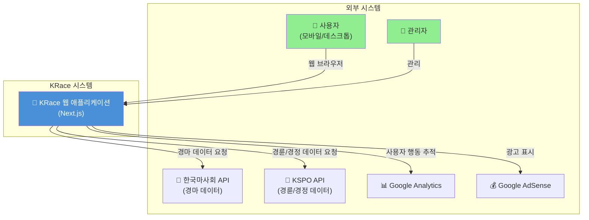
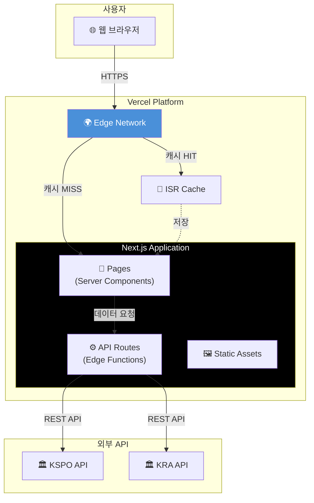
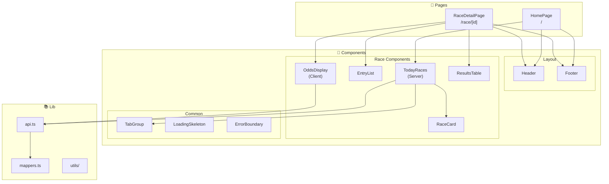
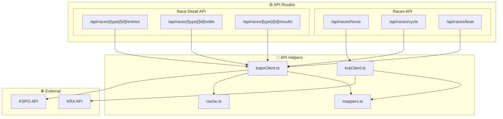
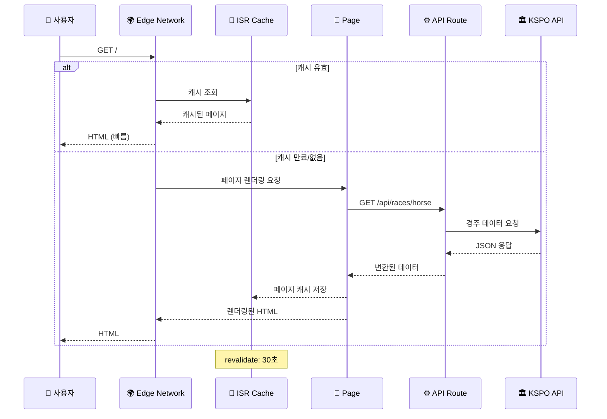
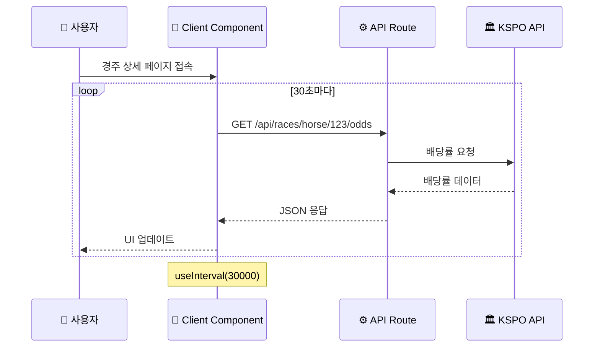
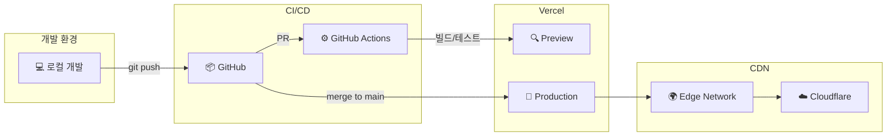

# ARCHITECTURE.md - 시스템 아키텍처

> **이 문서는 KRace 시스템의 전체 아키텍처를 정의합니다.**
> 시스템 설계의 근거와 주요 결정 사항을 포함합니다.

---

## 변경 이력 (Changelog)

| 버전 | 날짜 | 작성자 | 변경 내용 |
|------|------|--------|----------|
| 1.0.0 | 2025-11-25 | @Prometheus-P | 최초 작성 |

## 관련 문서 (Related Documents)

- [CONTEXT.md](../../CONTEXT.md) - 프로젝트 컨텍스트
- [PRD.md](./PRD.md) - 제품 요구사항
- [API_SPEC.md](./API_SPEC.md) - API 명세
- [BACKEND_DESIGN.md](./BACKEND_DESIGN.md) - 백엔드 설계
- [FRONTEND_SPEC.md](./FRONTEND_SPEC.md) - 프론트엔드 스펙

---

## 📋 목차

1. [아키텍처 개요](#1-아키텍처-개요)
2. [시스템 컨텍스트](#2-시스템-컨텍스트)
3. [컨테이너 다이어그램](#3-컨테이너-다이어그램)
4. [컴포넌트 다이어그램](#4-컴포넌트-다이어그램)
5. [데이터 흐름](#5-데이터-흐름)
6. [기술 스택](#6-기술-스택)
7. [배포 아키텍처](#7-배포-아키텍처)
8. [보안 아키텍처](#8-보안-아키텍처)
9. [아키텍처 결정 기록](#9-아키텍처-결정-기록)

---

## 1. 아키텍처 개요

### 1.1 아키텍처 원칙

```
┌─────────────────────────────────────────────────────────────┐
│  🏛️ 아키텍처 원칙                                           │
├─────────────────────────────────────────────────────────────┤
│                                                             │
│  1. 단순성 (Simplicity)                                     │
│     • 복잡성 최소화, 이해하기 쉬운 구조                       │
│     • 불필요한 추상화 지양                                   │
│                                                             │
│  2. 성능 우선 (Performance First)                           │
│     • 사용자 경험에 직접 영향                                │
│     • ISR, 캐싱 적극 활용                                    │
│                                                             │
│  3. 확장 가능성 (Scalability)                               │
│     • 수평 확장 가능한 설계                                  │
│     • 서버리스 아키텍처 활용                                 │
│                                                             │
│  4. 관심사 분리 (Separation of Concerns)                    │
│     • UI, 비즈니스 로직, 데이터 접근 분리                    │
│     • 각 레이어의 명확한 책임                                │
│                                                             │
│  5. 테스트 용이성 (Testability)                             │
│     • 의존성 주입                                            │
│     • 순수 함수 선호                                         │
│                                                             │
└─────────────────────────────────────────────────────────────┘
```

### 1.2 아키텍처 스타일

**선택: 모놀리식 + 서버리스 하이브리드**

| 스타일 | 적용 | 이유 |
|--------|------|------|
| 모놀리식 | Next.js 앱 | 초기 개발 속도, 단순성 |
| 서버리스 | Vercel Edge | 자동 스케일링, 비용 효율 |
| JAMstack | 정적 생성 + ISR | 성능, SEO |

---

## 2. 시스템 컨텍스트

### 2.1 C4 Context Diagram



### 2.2 시스템 경계

| 경계 내부 | 경계 외부 |
|----------|----------|
| Next.js 웹 애플리케이션 | KSPO 공공 API |
| API Routes | 한국마사회 API |
| 정적 자산 | Google Analytics |
| ISR 캐시 | Google AdSense |
| | Vercel 인프라 |
| | Cloudflare CDN |

---

## 3. 컨테이너 다이어그램

### 3.1 C4 Container Diagram



### 3.2 컨테이너 설명

| 컨테이너 | 기술 | 역할 |
|----------|------|------|
| **Pages** | React Server Components | UI 렌더링, SEO |
| **API Routes** | Next.js API Routes | 데이터 프록시, 변환 |
| **ISR Cache** | Vercel Cache | 페이지 캐싱 |
| **Edge Network** | Vercel Edge | 전역 배포, 라우팅 |
| **Static Assets** | CDN | 정적 파일 서빙 |

---

## 4. 컴포넌트 다이어그램

### 4.1 프론트엔드 컴포넌트



### 4.2 백엔드 컴포넌트 (API Routes)



---

## 5. 데이터 흐름

### 5.1 경주 목록 조회 흐름



### 5.2 배당률 실시간 조회 흐름



### 5.3 캐싱 전략

```
┌─────────────────────────────────────────────────────────────┐
│  💾 캐싱 레이어                                              │
├─────────────────────────────────────────────────────────────┤
│                                                             │
│  Layer 1: 브라우저 캐시                                      │
│  ─────────────────────────────────────────────              │
│  • 정적 자산 (JS, CSS, 이미지): 1년                          │
│  • HTML: no-cache (ISR과 연동)                              │
│                                                             │
│  Layer 2: CDN (Vercel Edge)                                 │
│  ─────────────────────────────────────────────              │
│  • ISR 페이지: stale-while-revalidate                       │
│  • API 응답: Cache-Control 헤더                             │
│                                                             │
│  Layer 3: ISR Cache                                         │
│  ─────────────────────────────────────────────              │
│  • 홈페이지: 30초                                            │
│  • 경주 상세: 60초                                           │
│  • 결과 페이지: 5분                                          │
│                                                             │
│  Layer 4: API Response Cache                                │
│  ─────────────────────────────────────────────              │
│  • 경주 목록: 30초                                           │
│  • 출주표: 60초                                              │
│  • 배당률: 캐시 없음 (실시간)                                 │
│  • 결과: 5분 (확정 후)                                       │
│                                                             │
└─────────────────────────────────────────────────────────────┘
```

---

## 6. 기술 스택

### 6.1 기술 스택 개요

```
┌─────────────────────────────────────────────────────────────┐
│                        FRONTEND                              │
├─────────────────────────────────────────────────────────────┤
│                                                             │
│  Framework:    Next.js 14.2.33 (App Router)                 │
│  UI Library:   React 18.3.1                                 │
│  Language:     TypeScript 5.9.3                             │
│  Styling:      Tailwind CSS 3.4.0                           │
│  State:        React Server Components + useState           │
│                                                             │
├─────────────────────────────────────────────────────────────┤
│                        BACKEND                               │
├─────────────────────────────────────────────────────────────┤
│                                                             │
│  Runtime:      Next.js API Routes (Node.js)                 │
│  Edge:         Vercel Edge Functions                        │
│  Caching:      Vercel ISR + HTTP Cache                      │
│                                                             │
├─────────────────────────────────────────────────────────────┤
│                      INFRASTRUCTURE                          │
├─────────────────────────────────────────────────────────────┤
│                                                             │
│  Hosting:      Vercel                                       │
│  CDN:          Vercel Edge Network + Cloudflare             │
│  DNS:          Cloudflare                                   │
│  Analytics:    Google Analytics 4                           │
│  Monitoring:   Vercel Analytics                             │
│                                                             │
├─────────────────────────────────────────────────────────────┤
│                        TESTING                               │
├─────────────────────────────────────────────────────────────┤
│                                                             │
│  Unit:         Jest 30.2.0                                  │
│  Component:    @testing-library/react 16.3.0                │
│  E2E:          Playwright 1.56.1                            │
│                                                             │
└─────────────────────────────────────────────────────────────┘
```

### 6.2 기술 선택 근거

| 기술 | 선택 이유 | 대안 |
|------|----------|------|
| **Next.js** | SSR/ISR/SSG 통합, App Router | Remix, Nuxt |
| **React** | 생태계, 커뮤니티, Server Components | Vue, Svelte |
| **TypeScript** | 타입 안전성, DX | JavaScript |
| **Tailwind** | 빠른 개발, 번들 최적화 | CSS Modules, Styled |
| **Vercel** | Next.js 최적화, 서버리스 | AWS, Netlify |
| **Jest** | React 생태계 표준 | Vitest |
| **Playwright** | 크로스 브라우저, 안정성 | Cypress |

---

## 7. 배포 아키텍처

### 7.1 배포 환경



### 7.2 환경별 설정

| 환경 | URL | 용도 | 캐시 TTL |
|------|-----|------|----------|
| Local | localhost:3000 | 개발 | 없음 |
| Preview | *.vercel.app | PR 리뷰 | 30초 |
| Production | krace.co.kr | 운영 | 5분 |

### 7.3 배포 파이프라인

```yaml
# 배포 흐름
1. PR 생성
   └─> GitHub Actions
       ├─> Lint
       ├─> Type Check
       ├─> Unit Tests
       └─> Build
   └─> Vercel Preview 배포
   └─> E2E Tests

2. PR Merge (main)
   └─> Vercel Production 자동 배포
   └─> Lighthouse CI
   └─> Slack 알림

3. 롤백 (필요시)
   └─> Vercel Dashboard
       └─> 이전 배포로 Promote
```

---

## 8. 보안 아키텍처

### 8.1 보안 레이어

```
┌─────────────────────────────────────────────────────────────┐
│  🔒 보안 아키텍처                                            │
├─────────────────────────────────────────────────────────────┤
│                                                             │
│  Layer 1: 네트워크                                          │
│  ─────────────────────────────────────────────              │
│  • HTTPS 강제 (TLS 1.3)                                     │
│  • Cloudflare DDoS 보호                                     │
│  • HSTS 헤더                                                │
│                                                             │
│  Layer 2: 애플리케이션                                       │
│  ─────────────────────────────────────────────              │
│  • CSP (Content Security Policy)                            │
│  • XSS 방지 (React 자동 이스케이프)                          │
│  • CSRF 보호 (SameSite Cookie)                              │
│                                                             │
│  Layer 3: API                                               │
│  ─────────────────────────────────────────────              │
│  • Rate Limiting (100 req/min)                              │
│  • API 키 서버사이드 관리                                    │
│  • 입력 검증                                                 │
│                                                             │
│  Layer 4: 데이터                                            │
│  ─────────────────────────────────────────────              │
│  • 환경 변수 암호화 (Vercel)                                 │
│  • 민감 정보 클라이언트 노출 금지                            │
│                                                             │
└─────────────────────────────────────────────────────────────┘
```

### 8.2 보안 헤더

```typescript
// next.config.js 보안 헤더 설정
const securityHeaders = [
  {
    key: 'X-DNS-Prefetch-Control',
    value: 'on'
  },
  {
    key: 'Strict-Transport-Security',
    value: 'max-age=63072000; includeSubDomains; preload'
  },
  {
    key: 'X-Frame-Options',
    value: 'SAMEORIGIN'
  },
  {
    key: 'X-Content-Type-Options',
    value: 'nosniff'
  },
  {
    key: 'Referrer-Policy',
    value: 'origin-when-cross-origin'
  },
  {
    key: 'Content-Security-Policy',
    value: "default-src 'self'; script-src 'self' 'unsafe-inline' 'unsafe-eval' https://www.googletagmanager.com; style-src 'self' 'unsafe-inline';"
  }
];
```

### 8.3 API 키 관리

```
┌─────────────────────────────────────────────────────────────┐
│  🔑 API 키 관리                                              │
├─────────────────────────────────────────────────────────────┤
│                                                             │
│  ❌ 클라이언트 노출 금지:                                    │
│  • KRA_API_KEY                                              │
│  • KSPO_API_KEY                                             │
│                                                             │
│  ✅ 클라이언트 노출 가능:                                    │
│  • NEXT_PUBLIC_GA_ID                                        │
│  • NEXT_PUBLIC_SITE_URL                                     │
│                                                             │
│  저장 위치:                                                  │
│  • 개발: .env.local (git 제외)                              │
│  • 프로덕션: Vercel Environment Variables                   │
│                                                             │
└─────────────────────────────────────────────────────────────┘
```

---

## 9. 아키텍처 결정 기록

### ADR-001: Next.js App Router 선택

**상태**: Accepted

**컨텍스트**:
- React 기반 프레임워크 선택 필요
- SSR, SSG, ISR 지원 필요
- SEO 최적화 중요

**결정**:
- Next.js 14 App Router 사용

**결과**:
- ✅ Server Components로 성능 향상
- ✅ ISR로 캐싱 최적화
- ✅ Vercel 배포 최적화
- ⚠️ 러닝 커브 존재

### ADR-002: 서버리스 아키텍처 선택

**상태**: Accepted

**컨텍스트**:
- 초기 트래픽 불확실
- 비용 효율 중요
- 운영 부담 최소화 필요

**결정**:
- Vercel 서버리스 플랫폼 사용
- API Routes로 백엔드 구현

**결과**:
- ✅ 자동 스케일링
- ✅ 운영 부담 최소화
- ✅ 비용 효율 (사용량 기반)
- ⚠️ Cold Start 존재 (Edge로 완화)

### ADR-003: 외부 DB 미사용

**상태**: Accepted

**컨텍스트**:
- MVP 단계에서 자체 데이터 저장 불필요
- 모든 데이터는 외부 API에서 제공
- 비용 및 복잡성 최소화

**결정**:
- 별도 데이터베이스 없이 외부 API + 캐싱으로 구현
- Phase 2에서 필요시 데이터베이스 도입 검토

**결과**:
- ✅ 인프라 단순화
- ✅ 비용 절감
- ✅ 운영 부담 감소
- ⚠️ 히스토리 검색 기능 제한 (Phase 2에서 해결)

---

## 📋 부록

### A. 다이어그램 범례

```
┌─────────────────────────────────────────────────────────────┐
│  📊 다이어그램 범례                                          │
├─────────────────────────────────────────────────────────────┤
│                                                             │
│  👤 사용자/액터                                              │
│  📄 페이지/컴포넌트                                          │
│  ⚙️ API/서비스                                               │
│  💾 저장소/캐시                                              │
│  🌍 네트워크/인프라                                          │
│  🏛️ 외부 시스템                                              │
│                                                             │
│  ─── 동기 통신                                               │
│  - - - 비동기 통신                                           │
│  ═══ 데이터 흐름                                             │
│                                                             │
└─────────────────────────────────────────────────────────────┘
```

### B. 참고 자료

- [Next.js 공식 문서](https://nextjs.org/docs)
- [Vercel 아키텍처 가이드](https://vercel.com/docs)
- [C4 Model](https://c4model.com/)

---

*이 문서는 시스템 아키텍처 변경 시 업데이트됩니다.*
