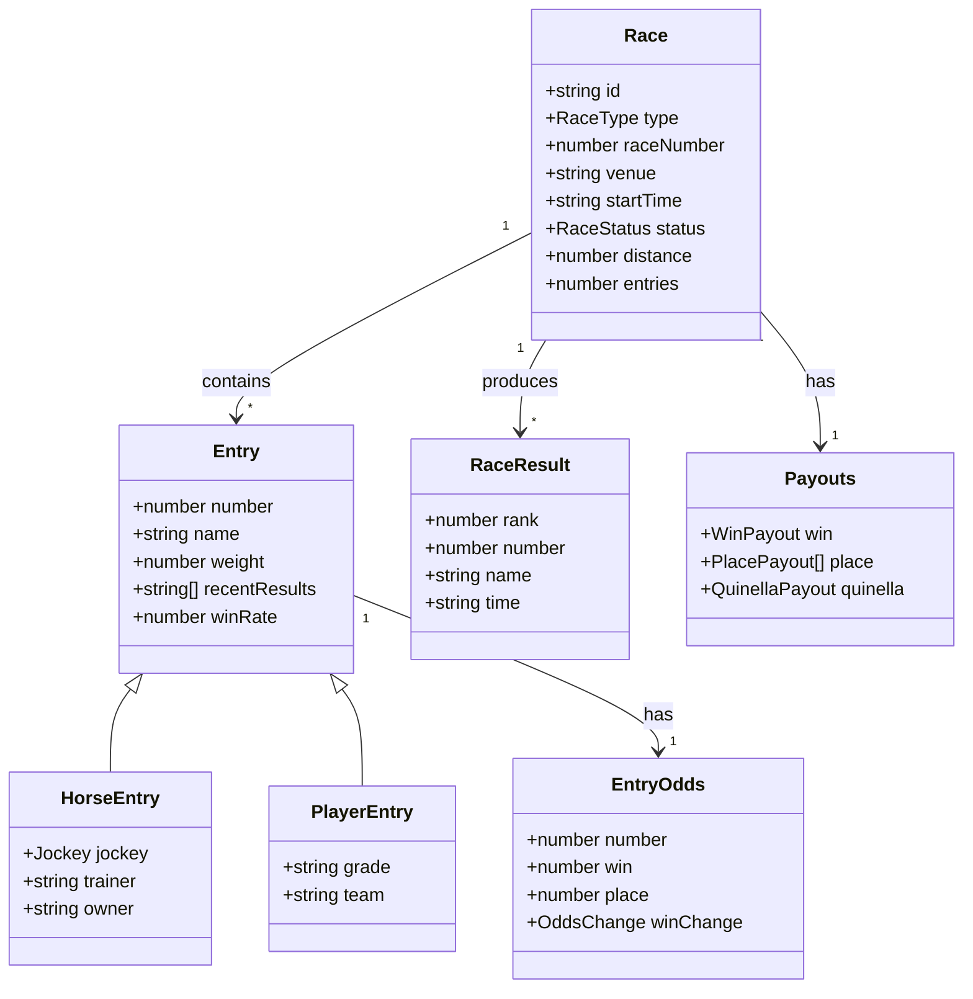
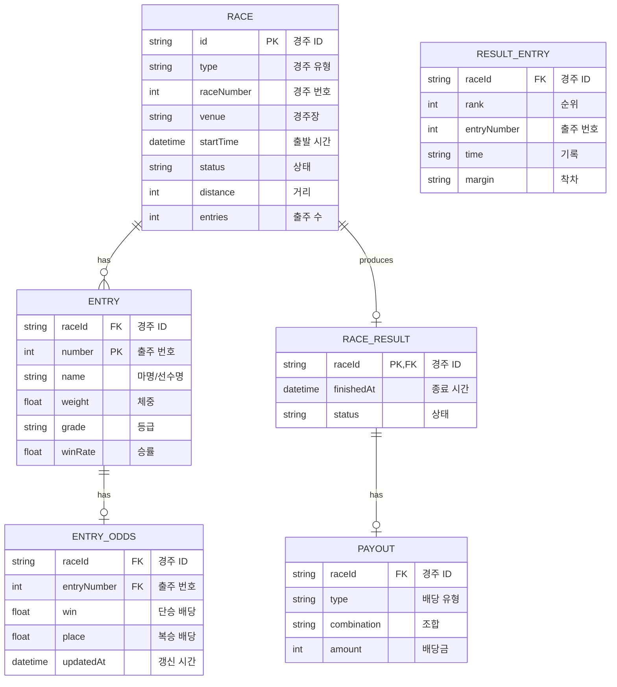

# DATA_MODEL.md - 데이터 모델

> **이 문서는 KRace 시스템의 데이터 모델을 정의합니다.**
> 타입 정의, 데이터 구조, 외부 API 매핑을 포함합니다.

---

## 변경 이력 (Changelog)

| 버전  | 날짜       | 작성자        | 변경 내용 |
| ----- | ---------- | ------------- | --------- |
| 1.0.0 | 2025-11-25 | @Prometheus-P | 최초 작성 |

## 관련 문서 (Related Documents)

- [API_SPEC.md](./API_SPEC.md) - API 명세
- [BACKEND_DESIGN.md](./BACKEND_DESIGN.md) - 백엔드 설계
- [ARCHITECTURE.md](./ARCHITECTURE.md) - 시스템 아키텍처

---

## 📋 목차

1. [데이터 아키텍처](#1-데이터-아키텍처)
2. [핵심 타입 정의](#2-핵심-타입-정의)
3. [도메인 모델](#3-도메인-모델)
4. [외부 API 데이터 매핑](#4-외부-api-데이터-매핑)
5. [데이터 검증](#5-데이터-검증)
6. [ERD 다이어그램](#6-erd-다이어그램)

---

## 1. 데이터 아키텍처

### 1.1 데이터 흐름 개요

```
┌─────────────────────────────────────────────────────────────┐
│  📊 KRace 데이터 아키텍처                                    │
├─────────────────────────────────────────────────────────────┤
│                                                             │
│  ┌──────────┐     ┌──────────┐     ┌──────────┐            │
│  │  KSPO    │     │  KRA     │     │ 기타 API │            │
│  │  API     │     │  API     │     │          │            │
│  └────┬─────┘     └────┬─────┘     └────┬─────┘            │
│       │                │                │                   │
│       └────────────────┼────────────────┘                   │
│                        │                                    │
│                        ▼                                    │
│              ┌─────────────────┐                            │
│              │    Mappers      │  ← 데이터 변환 레이어       │
│              │  (Raw → Domain) │                            │
│              └────────┬────────┘                            │
│                       │                                     │
│                       ▼                                     │
│              ┌─────────────────┐                            │
│              │  Domain Types   │  ← 내부 도메인 모델        │
│              │  (TypeScript)   │                            │
│              └────────┬────────┘                            │
│                       │                                     │
│                       ▼                                     │
│              ┌─────────────────┐                            │
│              │   API Response  │  ← 클라이언트 응답         │
│              │     (JSON)      │                            │
│              └─────────────────┘                            │
│                                                             │
└─────────────────────────────────────────────────────────────┘
```

### 1.2 데이터 저장 전략

| 데이터 유형 | 저장 방식 | 이유           |
| ----------- | --------- | -------------- |
| 경주 목록   | ISR 캐시  | 30초 주기 갱신 |
| 출주표      | ISR 캐시  | 60초 주기 갱신 |
| 배당률      | 실시간    | 캐시 없음      |
| 결과        | ISR 캐시  | 확정 후 5분    |
| 정적 데이터 | 빌드 타임 | 경주장 정보 등 |

### 1.3 데이터 정합성

```typescript
// 데이터 일관성 규칙
const DATA_CONSISTENCY_RULES = {
  // 경주 ID 형식
  raceIdFormat: /^(horse|cycle|boat)-\d{8}-[a-z]+-\d+$/,

  // 필수 필드
  requiredFields: {
    race: ['id', 'type', 'raceNumber', 'venue', 'startTime', 'status'],
    entry: ['number', 'name'],
    odds: ['number', 'win'],
    result: ['rank', 'number', 'name'],
  },

  // 값 범위
  valueRanges: {
    raceNumber: { min: 1, max: 20 },
    entryNumber: { min: 1, max: 16 },
    odds: { min: 1.0, max: 1000.0 },
    rank: { min: 1, max: 16 },
  },
};
```

---

## 2. 핵심 타입 정의

### 2.1 기본 타입

```typescript
// src/types/index.ts

// ═══════════════════════════════════════════════════════════
// 기본 열거형 (Enums)
// ═══════════════════════════════════════════════════════════

/**
 * 경주 유형
 * @description 지원하는 공영경주 종목
 */
export type RaceType = 'horse' | 'cycle' | 'boat';

/**
 * 경주 상태
 * @description 경주의 현재 진행 상태
 */
export type RaceStatus =
  | 'scheduled' // 예정
  | 'in_progress' // 진행중
  | 'finished' // 종료
  | 'cancelled'; // 취소

/**
 * 배당률 변화 방향
 */
export type OddsChange = 'up' | 'down' | 'same';

/**
 * 경주장 코드
 */
export type VenueCode =
  // 경마장
  | 'seoul'
  | 'busan'
  | 'jeju'
  // 경륜/경정장
  | 'changwon'
  | 'gwangmyeong'
  | 'misari';
```

### 2.2 경주 타입

```typescript
// ═══════════════════════════════════════════════════════════
// 경주 관련 타입 (Race)
// ═══════════════════════════════════════════════════════════

/**
 * 경주 정보
 * @description 경주 목록에서 사용되는 기본 정보
 */
export interface Race {
  /** 고유 식별자 (예: horse-20251125-seoul-1) */
  id: string;

  /** 경주 유형 */
  type: RaceType;

  /** 경주 번호 (1-20) */
  raceNumber: number;

  /** 경주장 이름 */
  venue: string;

  /** 경주장 코드 */
  venueCode: VenueCode;

  /** 출발 예정 시간 (ISO 8601) */
  startTime: string;

  /** 경주 상태 */
  status: RaceStatus;

  /** 경주 거리 (미터) */
  distance: number;

  /** 등급 (경마: 1-6등급) */
  class?: string;

  /** 출주 수 */
  entries: number;

  /** 상금 */
  prize?: string;

  /** 트랙 상태 (경마: 양호/다습/불량) */
  trackCondition?: string;

  /** 날씨 */
  weather?: string;
}

/**
 * 경주 상세 정보
 * @description 경주 상세 페이지에서 사용되는 확장 정보
 */
export interface RaceDetail extends Race {
  /** 출주표 */
  entries: Entry[];

  /** 경주 설명 */
  description?: string;

  /** 경주 조건 */
  conditions?: string;
}
```

### 2.3 출주 타입

```typescript
// ═══════════════════════════════════════════════════════════
// 출주 관련 타입 (Entry)
// ═══════════════════════════════════════════════════════════

/**
 * 출주 정보 (공통)
 * @description 모든 종목에서 공통으로 사용되는 출주 정보
 */
export interface Entry {
  /** 출주 번호 (1-16) */
  number: number;

  /** 마명 또는 선수명 */
  name: string;

  /** 나이 */
  age?: number;

  /** 체중 (kg) */
  weight: number;

  /** 최근 5경주 성적 */
  recentResults?: string[];

  /** 승률 (%) */
  winRate?: number;
}

/**
 * 경마 출주 정보
 * @description 경마 특화 출주 정보
 */
export interface HorseEntry extends Entry {
  /** 마체중 (kg) */
  horseWeight: number;

  /** 기수 정보 */
  jockey: {
    name: string;
    weight: number; // 부담중량
  };

  /** 조교사 */
  trainer: string;

  /** 마주 */
  owner: string;

  /** 부마 (아버지 말) */
  sire?: string;

  /** 모마 (어머니 말) */
  dam?: string;

  /** 생산지 */
  origin?: string;
}

/**
 * 경륜/경정 출주 정보
 * @description 경륜/경정 특화 출주 정보
 */
export interface PlayerEntry extends Entry {
  /** 선수 등급 */
  grade: string;

  /** 기어비 (경륜) */
  gearRatio?: string;

  /** 모터 번호 (경정) */
  motorNumber?: number;

  /** 보트 번호 (경정) */
  boatNumber?: number;

  /** 소속 */
  team?: string;
}
```

### 2.4 배당률 타입

```typescript
// ═══════════════════════════════════════════════════════════
// 배당률 관련 타입 (Odds)
// ═══════════════════════════════════════════════════════════

/**
 * 출주별 배당률
 */
export interface EntryOdds {
  /** 출주 번호 */
  number: number;

  /** 마명/선수명 */
  name: string;

  /** 단승 배당률 (1등 분석 지표) */
  win: number | null;

  /** 복승 배당률 (1-2등 진입 분석 지표) */
  place: number | null;

  /** 단승 변화 */
  winChange?: OddsChange;

  /** 복승 변화 */
  placeChange?: OddsChange;

  /** 이전 단승 배당률 (비교용) */
  previousWin?: number;
}

/**
 * 조합 배당률 (쌍승/삼복승 등)
 */
export interface CombinationOdds {
  /** 조합 (예: [1, 2] = 1번-2번 조합) */
  combination: number[];

  /** 배당률 */
  odds: number;
}

/**
 * 경주 배당률 전체
 */
export interface RaceOdds {
  /** 경주 ID */
  raceId: string;

  /** 마지막 갱신 시간 (ISO 8601) */
  updatedAt: string;

  /** 출주별 배당률 */
  odds: EntryOdds[];

  /** 쌍승 배당률 */
  quinella?: CombinationOdds[];

  /** 삼복승 배당률 */
  trio?: CombinationOdds[];
}
```

### 2.5 결과 타입

```typescript
// ═══════════════════════════════════════════════════════════
// 결과 관련 타입 (Result)
// ═══════════════════════════════════════════════════════════

/**
 * 착순 결과
 */
export interface RaceResult {
  /** 순위 (1-16) */
  rank: number;

  /** 출주 번호 */
  number: number;

  /** 마명/선수명 */
  name: string;

  /** 기록 (예: "1:12.5") */
  time?: string;

  /** 착차 (예: "1.5마신") */
  margin?: string;

  /** 실격 여부 */
  disqualified?: boolean;

  /** 실격 사유 */
  disqualificationReason?: string;
}

/**
 * 배당금 정보
 */
export interface Payouts {
  /** 단승 배당금 */
  win?: {
    number: number;
    payout: number; // 100원 기준 배당금
  };

  /** 복승 배당금 */
  place?: Array<{
    number: number;
    payout: number;
  }>;

  /** 쌍승 배당금 */
  quinella?: {
    combination: [number, number];
    payout: number;
  };

  /** 복연승 배당금 */
  exacta?: {
    combination: [number, number];
    payout: number;
  };

  /** 삼복승 배당금 */
  trio?: {
    combination: [number, number, number];
    payout: number;
  };
}

/**
 * 경주 결과 전체
 */
export interface RaceResults {
  /** 경주 ID */
  raceId: string;

  /** 경주 상태 */
  status: RaceStatus;

  /** 종료 시간 */
  finishedAt?: string;

  /** 상태 메시지 (진행중일 때) */
  message?: string;

  /** 착순 결과 */
  results?: RaceResult[];

  /** 배당금 */
  payouts?: Payouts;
}
```

---

## 3. 도메인 모델

### 3.1 도메인 모델 다이어그램



### 3.2 값 객체 (Value Objects)

```typescript
// ═══════════════════════════════════════════════════════════
// 값 객체 (Value Objects)
// ═══════════════════════════════════════════════════════════

/**
 * 경주 ID
 * @description 불변 값 객체로 경주 ID 관리
 */
export class RaceId {
  private constructor(
    public readonly type: RaceType,
    public readonly date: string,
    public readonly venue: VenueCode,
    public readonly raceNumber: number
  ) {}

  static create(type: RaceType, date: string, venue: VenueCode, raceNumber: number): RaceId {
    return new RaceId(type, date, venue, raceNumber);
  }

  static fromString(id: string): RaceId | null {
    const match = id.match(/^(horse|cycle|boat)-(\d{8})-([a-z]+)-(\d+)$/);
    if (!match) return null;

    const [, type, date, venue, number] = match;
    return new RaceId(type as RaceType, date, venue as VenueCode, parseInt(number));
  }

  toString(): string {
    return `${this.type}-${this.date}-${this.venue}-${this.raceNumber}`;
  }
}

/**
 * 배당률 값
 * @description null 허용 배당률 값 처리
 */
export class OddsValue {
  private constructor(public readonly value: number | null) {}

  static create(value: number | string | null | undefined): OddsValue {
    if (value === null || value === undefined || value === '') {
      return new OddsValue(null);
    }

    const numValue = typeof value === 'string' ? parseFloat(value) : value;

    if (isNaN(numValue) || numValue < 1.0) {
      return new OddsValue(null);
    }

    return new OddsValue(Math.round(numValue * 10) / 10);
  }

  isValid(): boolean {
    return this.value !== null;
  }

  format(): string {
    return this.value !== null ? this.value.toFixed(1) : '-';
  }
}
```

---

## 4. 외부 API 데이터 매핑

### 4.1 KSPO API 매핑

```typescript
// ═══════════════════════════════════════════════════════════
// KSPO API 응답 타입 (외부 데이터)
// ═══════════════════════════════════════════════════════════

/**
 * KSPO 경주 목록 API 원본 응답
 * @description 경륜/경정 API 원본 데이터 구조
 */
export interface KSPORaceResponse {
  rcDate: string; // 경주일 (YYYYMMDD)
  rcNo: string; // 경주번호
  trkCd: string; // 경주장 코드
  trkNm: string; // 경주장 이름
  rcTime: string; // 출발시간 (HHmm)
  rcDist: string; // 거리
  rcStat: string; // 상태 코드
  entCnt: string; // 출주 수
}

/**
 * KSPO 출주 API 원본 응답
 */
export interface KSPOEntryResponse {
  entNo: string; // 출주번호
  playerNm: string; // 선수명
  playerGrd: string; // 선수등급
  playerWgt: string; // 체중
  rcRslt1: string; // 최근 1경주
  rcRslt2: string; // 최근 2경주
  rcRslt3: string; // 최근 3경주
  rcRslt4: string; // 최근 4경주
  rcRslt5: string; // 최근 5경주
  winRate: string; // 승률
}

/**
 * KSPO 배당률 API 원본 응답
 */
export interface KSPOOddsResponse {
  entNo: string; // 출주번호
  oddsDansng: string; // 단승 배당
  oddsBoksng: string; // 복승 배당
}
```

### 4.2 매퍼 함수

```typescript
// ═══════════════════════════════════════════════════════════
// 데이터 매퍼 (Mappers)
// ═══════════════════════════════════════════════════════════

/**
 * KSPO 경주 데이터를 내부 Race 타입으로 변환
 */
export function mapKSPORace(raw: KSPORaceResponse, type: RaceType): Race {
  return {
    id: generateRaceId(type, raw.rcDate, raw.trkCd, raw.rcNo),
    type,
    raceNumber: parseInt(raw.rcNo),
    venue: raw.trkNm,
    venueCode: mapVenueCode(raw.trkCd),
    startTime: formatStartTime(raw.rcDate, raw.rcTime),
    status: mapRaceStatus(raw.rcStat),
    distance: parseInt(raw.rcDist),
    entries: parseInt(raw.entCnt),
  };
}

/**
 * 경주 ID 생성
 * @example "cycle-20251125-changwon-1"
 */
function generateRaceId(type: RaceType, date: string, venueCode: string, raceNo: string): string {
  const venue = mapVenueCode(venueCode);
  return `${type}-${date}-${venue}-${raceNo}`;
}

/**
 * 경주장 코드 매핑
 */
function mapVenueCode(code: string): VenueCode {
  const venueMap: Record<string, VenueCode> = {
    '01': 'changwon',
    '02': 'gwangmyeong',
    '03': 'misari',
    // 경마
    S: 'seoul',
    B: 'busan',
    J: 'jeju',
  };
  return venueMap[code] || 'changwon';
}

/**
 * 경주 상태 매핑
 */
function mapRaceStatus(code: string): RaceStatus {
  const statusMap: Record<string, RaceStatus> = {
    '0': 'scheduled',
    '1': 'in_progress',
    '2': 'finished',
    '9': 'cancelled',
  };
  return statusMap[code] || 'scheduled';
}

/**
 * 출발 시간 포맷팅 (ISO 8601)
 */
function formatStartTime(date: string, time: string): string {
  // YYYYMMDD + HHmm → ISO 8601
  const year = date.substring(0, 4);
  const month = date.substring(4, 6);
  const day = date.substring(6, 8);
  const hour = time.substring(0, 2);
  const minute = time.substring(2, 4);

  return `${year}-${month}-${day}T${hour}:${minute}:00+09:00`;
}

/**
 * KSPO 출주 데이터 매핑
 */
export function mapKSPOEntry(raw: KSPOEntryResponse): PlayerEntry {
  return {
    number: parseInt(raw.entNo),
    name: raw.playerNm,
    weight: parseFloat(raw.playerWgt),
    grade: raw.playerGrd,
    recentResults: [raw.rcRslt1, raw.rcRslt2, raw.rcRslt3, raw.rcRslt4, raw.rcRslt5].filter(
      Boolean
    ),
    winRate: parseFloat(raw.winRate) || 0,
  };
}

/**
 * KSPO 배당률 데이터 매핑
 */
export function mapKSPOOdds(raw: KSPOOddsResponse, name: string): EntryOdds {
  return {
    number: parseInt(raw.entNo),
    name,
    win: OddsValue.create(raw.oddsDansng).value,
    place: OddsValue.create(raw.oddsBoksng).value,
  };
}
```

### 4.3 매핑 테이블

| 내부 필드   | KSPO 필드                   | 변환                  |
| ----------- | --------------------------- | --------------------- |
| `id`        | `rcDate` + `trkCd` + `rcNo` | 조합                  |
| `venue`     | `trkNm`                     | 직접                  |
| `startTime` | `rcDate` + `rcTime`         | ISO 8601              |
| `status`    | `rcStat`                    | 코드 매핑             |
| `distance`  | `rcDist`                    | parseInt              |
| `entries`   | `entCnt`                    | parseInt              |
| `odds.win`  | `oddsDansng`                | parseFloat, null 처리 |

---

## 5. 데이터 검증

### 5.1 Zod 스키마

```typescript
import { z } from 'zod';

// ═══════════════════════════════════════════════════════════
// Zod 검증 스키마
// ═══════════════════════════════════════════════════════════

/**
 * 경주 유형 스키마
 */
export const RaceTypeSchema = z.enum(['horse', 'cycle', 'boat']);

/**
 * 경주 상태 스키마
 */
export const RaceStatusSchema = z.enum(['scheduled', 'in_progress', 'finished', 'cancelled']);

/**
 * 경주 스키마
 */
export const RaceSchema = z.object({
  id: z.string().regex(/^(horse|cycle|boat)-\d{8}-[a-z]+-\d+$/),
  type: RaceTypeSchema,
  raceNumber: z.number().int().min(1).max(20),
  venue: z.string().min(1),
  venueCode: z.string(),
  startTime: z.string().datetime(),
  status: RaceStatusSchema,
  distance: z.number().int().positive(),
  entries: z.number().int().min(0).max(16),
  class: z.string().optional(),
  prize: z.string().optional(),
});

/**
 * 출주 스키마
 */
export const EntrySchema = z.object({
  number: z.number().int().min(1).max(16),
  name: z.string().min(1),
  weight: z.number().positive(),
  recentResults: z.array(z.string()).max(5).optional(),
  winRate: z.number().min(0).max(100).optional(),
});

/**
 * 배당률 스키마
 */
export const EntryOddsSchema = z.object({
  number: z.number().int().min(1).max(16),
  name: z.string().min(1),
  win: z.number().min(1.0).max(1000).nullable(),
  place: z.number().min(1.0).max(1000).nullable(),
  winChange: z.enum(['up', 'down', 'same']).optional(),
  placeChange: z.enum(['up', 'down', 'same']).optional(),
});

/**
 * API 요청 파라미터 스키마
 */
export const RaceListParamsSchema = z.object({
  date: z
    .string()
    .regex(/^\d{4}-\d{2}-\d{2}$/)
    .optional(),
});

export const RaceDetailParamsSchema = z.object({
  type: RaceTypeSchema,
  id: z.string().min(1),
});
```

### 5.2 검증 유틸리티

```typescript
// ═══════════════════════════════════════════════════════════
// 검증 유틸리티
// ═══════════════════════════════════════════════════════════

/**
 * 날짜 검증
 */
export function isValidDate(dateString: string): boolean {
  const regex = /^\d{4}-\d{2}-\d{2}$/;
  if (!regex.test(dateString)) return false;

  const date = new Date(dateString);
  return date instanceof Date && !isNaN(date.getTime());
}

/**
 * 경주 ID 검증
 */
export function isValidRaceId(id: string): boolean {
  return /^(horse|cycle|boat)-\d{8}-[a-z]+-\d+$/.test(id);
}

/**
 * 배당률 값 검증
 */
export function isValidOdds(odds: number | null): boolean {
  if (odds === null) return true; // null 허용
  return odds >= 1.0 && odds <= 1000;
}

/**
 * API 응답 검증
 */
export function validateRaceResponse(data: unknown): Race[] {
  const schema = z.array(RaceSchema);
  const result = schema.safeParse(data);

  if (!result.success) {
    console.error('데이터 검증 실패:', result.error);
    return [];
  }

  return result.data;
}
```

---

## 6. ERD 다이어그램

### 6.1 논리적 ERD



### 6.2 참고: 데이터베이스 미사용

현재 MVP 단계에서는 별도의 데이터베이스를 사용하지 않습니다.

| 결정         | 이유                                   |
| ------------ | -------------------------------------- |
| DB 미사용    | 모든 데이터가 외부 API에서 실시간 제공 |
| ISR 캐싱     | Vercel ISR로 충분한 캐싱               |
| Phase 2 검토 | 히스토리 기능 구현 시 DB 도입 검토     |

---

## 📋 부록

### A. 타입 파일 위치

```
src/types/
├── index.ts          # 모든 타입 export
├── race.ts           # 경주 관련 타입
├── entry.ts          # 출주 관련 타입
├── odds.ts           # 배당률 관련 타입
├── result.ts         # 결과 관련 타입
└── api.ts            # API 응답 타입
```

### B. 외부 API 문서

- [KSPO 공공데이터](https://www.data.go.kr/data/15044947/openapi.do)
- [한국마사회 API](https://www.data.go.kr/data/15000419/openapi.do)

---

_이 문서는 데이터 모델 변경 시 업데이트됩니다._
