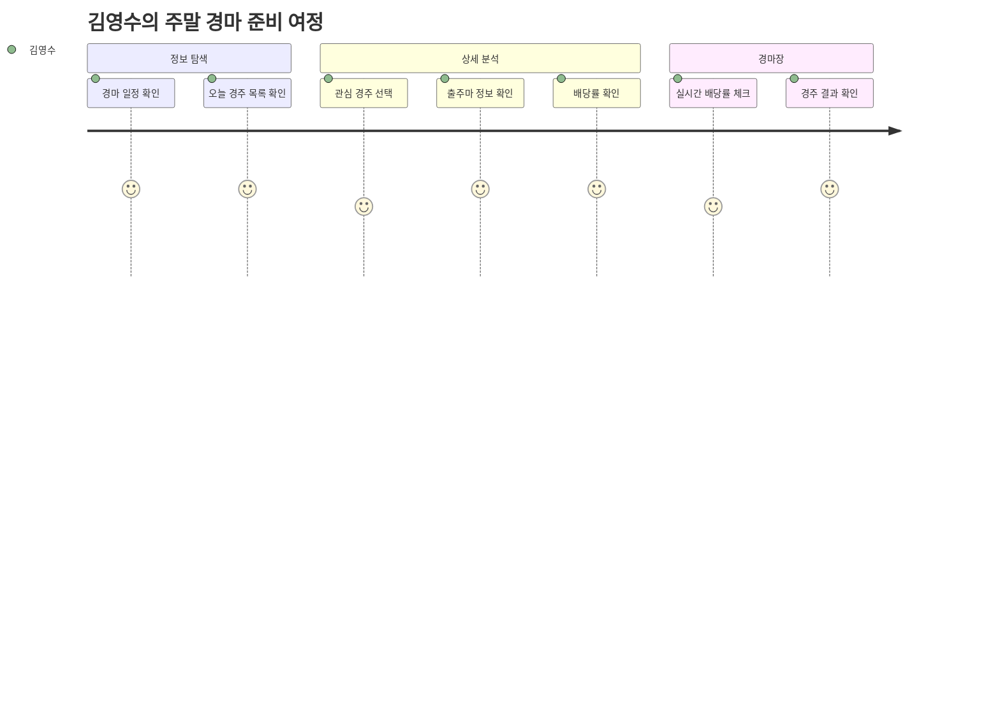
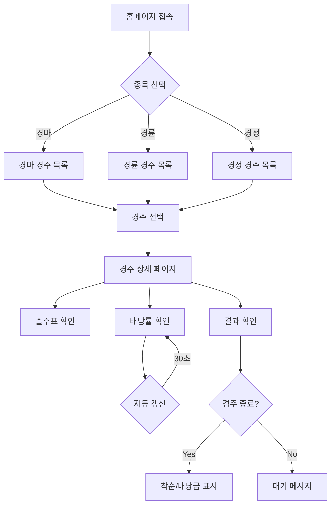
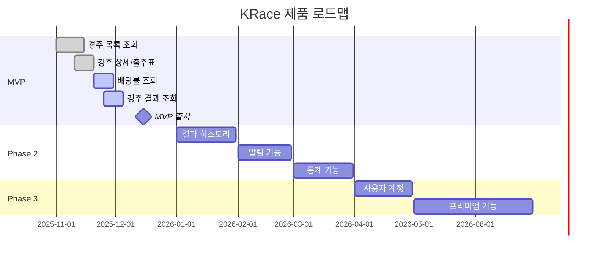

# PRD.md - 제품 요구사항 문서

> **이 문서는 KRace 제품의 전체 요구사항을 정의합니다.**
> 모든 기능 개발은 이 문서를 기반으로 진행됩니다.
> ⚖️ **면책**: 본 서비스는 베팅을 유도하지 않으며, 데이터 기반의 분석 정보만을 제공합니다.

---

## 변경 이력 (Changelog)

| 버전  | 날짜       | 작성자        | 변경 내용 |
| ----- | ---------- | ------------- | --------- |
| 1.0.0 | 2025-11-25 | @Prometheus-P | 최초 작성 |

## 관련 문서 (Related Documents)

- [CONTEXT.md](../../CONTEXT.md) - 프로젝트 컨텍스트
- [ARCHITECTURE.md](./ARCHITECTURE.md) - 시스템 아키텍처
- [FRONTEND_SPEC.md](./FRONTEND_SPEC.md) - 프론트엔드 상세 스펙
- [API_SPEC.md](./API_SPEC.md) - API 명세

---

## 📋 목차

1. [제품 개요](#1-제품-개요)
2. [목표 및 성공 지표](#2-목표-및-성공-지표)
3. [사용자 정의](#3-사용자-정의)
4. [기능 요구사항](#4-기능-요구사항)
5. [비기능 요구사항](#5-비기능-요구사항)
6. [제약 사항](#6-제약-사항)
7. [릴리스 계획](#7-릴리스-계획)
8. [부록](#8-부록)

---

## 1. 제품 개요

### 1.1 제품 비전

```
┌─────────────────────────────────────────────────────────────┐
│                                                             │
│  "경마, 경륜, 경정 정보를 가장 빠르고 정확하게,               │
│   누구나 쉽게 접근할 수 있는 국내 최고의 경주 정보 플랫폼"     │
│                                                             │
└─────────────────────────────────────────────────────────────┘
```

### 1.2 제품 정의

| 항목       | 내용               |
| ---------- | ------------------ |
| **제품명** | KRace (케이레이스) |
| **도메인** | racelab.kr         |
| **타입**   | B2C 웹 서비스      |
| **플랫폼** | 웹 (모바일 반응형) |

### 1.3 핵심 가치 제안

| 가치       | 설명                      | 경쟁 우위           |
| ---------- | ------------------------- | ------------------- |
| **통합**   | 경마/경륜/경정 3종목 통합 | 기존: 종목별 분산   |
| **속도**   | 2초 이내 페이지 로드      | 기존: 평균 5초 이상 |
| **접근성** | 모바일 최적화 UI          | 기존: 데스크톱 중심 |
| **신뢰성** | 공식 API 기반 데이터      | 기존: 출처 불명     |

### 1.4 문제 정의

```
┌─────────────────────────────────────────────────────────────┐
│  😤 사용자 Pain Points                                       │
├─────────────────────────────────────────────────────────────┤
│                                                             │
│  1. "경마/경륜/경정 정보가 각각 다른 사이트에 있어서 불편해요"  │
│     → 3개 종목을 한 곳에서 조회                              │
│                                                             │
│  2. "기존 사이트가 느리고 모바일에서 안 보여요"               │
│     → Next.js ISR로 빠른 로딩, 반응형 UI                     │
│                                                             │
│  3. "배당률 정보가 실시간이 아니에요"                         │
│     → 30초 주기 자동 갱신                                    │
│                                                             │
│  4. "UI가 복잡하고 원하는 정보를 찾기 어려워요"               │
│     → 직관적인 탭 기반 UI, 핵심 정보 우선 표시               │
│                                                             │
└─────────────────────────────────────────────────────────────┘
```

---

## 2. 목표 및 성공 지표

### 2.1 비즈니스 목표

| 목표        | 측정 지표      | 목표값     | 기간  |
| ----------- | -------------- | ---------- | ----- |
| 사용자 확보 | DAU            | 10,000명   | 6개월 |
| 참여도      | 평균 세션 시간 | 3분 이상   | 3개월 |
| 재방문      | 재방문율       | 40%        | 3개월 |
| 수익화      | 월 광고 수익   | ₩1,000,000 | 6개월 |

### 2.2 제품 목표

| 목표   | 측정 지표     | 목표값       |
| ------ | ------------- | ------------ |
| 성능   | LCP           | < 2.5초      |
| 성능   | TTFB          | < 600ms      |
| 안정성 | 가용성        | 99.9%        |
| 품질   | 버그 0건 출시 | Critical 0건 |

### 2.3 North Star Metric

```
┌─────────────────────────────────────────────────────────────┐
│                                                             │
│  ⭐ North Star Metric: 주간 활성 사용자 (WAU)                │
│                                                             │
│  목표: 출시 후 3개월 내 WAU 50,000명 달성                    │
│                                                             │
│  이유: WAU가 제품의 지속적 가치와 사용자 습관 형성을          │
│        가장 잘 반영하는 지표                                 │
│                                                             │
└─────────────────────────────────────────────────────────────┘
```

### 2.4 OKR (Objectives and Key Results)

**Q1 2025 OKR**

```markdown
Objective: 국내 최고의 경주 정보 플랫폼 MVP 출시

KR1: MVP 기능 100% 구현 및 프로덕션 배포
KR2: 페이지 로드 시간 2초 이내 달성
KR3: 출시 첫 주 DAU 1,000명 달성
KR4: 사용자 만족도 NPS 40 이상
```

---

## 3. 사용자 정의

### 3.1 타겟 사용자

```
┌─────────────────────────────────────────────────────────────┐
│  👥 사용자 세그먼트                                          │
├─────────────────────────────────────────────────────────────┤
│                                                             │
│  Primary (70%): 경주 참여자                                 │
│  ─────────────────────────────────────────────              │
│  • 30-60세 남성                                             │
│  • 주 1회 이상 경주 참여                                     │
│  • 모바일 사용 선호                                          │
│  • 실시간 정보에 민감                                        │
│                                                             │
│  Secondary (20%): 정보 탐색자                               │
│  ─────────────────────────────────────────────              │
│  • 경주 결과/통계 확인 목적                                  │
│  • 비정기적 방문                                             │
│                                                             │
│  Tertiary (10%): 신규 입문자                                │
│  ─────────────────────────────────────────────              │
│  • 경주에 관심을 갖기 시작한 사용자                          │
│  • 기본 정보 학습 목적                                       │
│                                                             │
└─────────────────────────────────────────────────────────────┘
```

### 3.2 사용자 페르소나

#### 페르소나 1: 김영수 (핵심 사용자)

```
┌─────────────────────────────────────────────────────────────┐
│  👤 김영수 (52세, 회사원)                                    │
├─────────────────────────────────────────────────────────────┤
│                                                             │
│  배경:                                                       │
│  • 20년 경력의 경마 팬                                       │
│  • 주말마다 경마장 방문                                      │
│  • 스마트폰 사용에 익숙                                      │
│                                                             │
│  목표:                                                       │
│  • 경마장 방문 전 오늘의 경주 정보 빠르게 확인               │
│  • 출퇴근 시간에 모바일로 간편하게 정보 확인                  │
│  • 배당률 변화 추이 파악                                     │
│                                                             │
│  고충:                                                       │
│  • 기존 사이트가 복잡하고 느림                               │
│  • 모바일에서 정보 확인이 불편                               │
│  • 여러 사이트를 돌아다녀야 함                               │
│                                                             │
│  기대:                                                       │
│  • 한 곳에서 모든 정보 확인                                  │
│  • 빠른 로딩 속도                                            │
│  • 깔끔하고 직관적인 UI                                      │
│                                                             │
└─────────────────────────────────────────────────────────────┘
```

#### 페르소나 2: 박지현 (신규 입문자)

```
┌─────────────────────────────────────────────────────────────┐
│  👤 박지현 (28세, 직장인)                                    │
├─────────────────────────────────────────────────────────────┤
│                                                             │
│  배경:                                                       │
│  • 최근 경마에 관심을 갖기 시작                              │
│  • 친구와 함께 경마장 첫 방문 예정                           │
│  • 디지털 네이티브                                           │
│                                                             │
│  목표:                                                       │
│  • 경마 기본 용어와 규칙 이해                                │
│  • 경주 일정 확인                                            │
│  • 출주마 정보 확인                                          │
│                                                             │
│  고충:                                                       │
│  • 경마 용어가 어려움                                        │
│  • 어디서 정보를 찾아야 할지 모름                            │
│  • 복잡한 UI에 당황                                          │
│                                                             │
│  기대:                                                       │
│  • 쉽고 직관적인 인터페이스                                  │
│  • 필수 정보만 간결하게                                      │
│  • 용어 설명 제공                                            │
│                                                             │
└─────────────────────────────────────────────────────────────┘
```

### 3.3 사용자 여정 지도



---

## 4. 기능 요구사항

### 4.1 기능 매트릭스

| ID    | 기능              | 우선순위 | Phase   | 상태      |
| ----- | ----------------- | -------- | ------- | --------- |
| F-001 | 경주 목록 조회    | P0       | MVP     | ✅ 완료   |
| F-002 | 경주 상세 정보    | P0       | MVP     | ✅ 완료   |
| F-003 | 출주표 조회       | P0       | MVP     | ✅ 완료   |
| F-004 | 배당률 조회       | P0       | MVP     | 🔄 진행중 |
| F-005 | 경주 결과 조회    | P0       | MVP     | 🔄 진행중 |
| F-006 | 탭 기반 종목 전환 | P0       | MVP     | ✅ 완료   |
| F-007 | 반응형 UI         | P0       | MVP     | ✅ 완료   |
| F-008 | SEO 최적화        | P1       | MVP     | ✅ 완료   |
| F-009 | 결과 히스토리     | P1       | Phase 2 | ⏳ 예정   |
| F-010 | 관심 경주 알림    | P2       | Phase 2 | ⏳ 예정   |
| F-011 | 기수/선수 통계    | P2       | Phase 2 | ⏳ 예정   |
| F-012 | 사용자 계정       | P2       | Phase 3 | ⏳ 예정   |

### 4.2 기능 상세 명세

#### F-001: 경주 목록 조회

```yaml
ID: F-001
Title: 경주 목록 조회
Priority: P0 (Must Have)
Phase: MVP

Description: |
  사용자가 오늘의 경마/경륜/경정 경주 목록을 조회할 수 있다.

User Story: |
  사용자로서, 오늘 진행되는 경주 목록을 한눈에 보고 싶다.
  그래야 관심 있는 경주를 빠르게 찾을 수 있다.

Acceptance Criteria:
  - [ ] 탭으로 경마/경륜/경정 전환 가능
  - [ ] 각 탭에서 해당 종목의 오늘 경주 목록 표시
  - [ ] 경주별 경주장, 경주번호, 출발시간 표시
  - [ ] 경주 진행 상태 표시 (예정/진행중/종료)
  - [ ] 페이지 로드 시간 2초 이내
  - [ ] 모바일/데스크톱 반응형 지원

UI/UX:
  - 기본 탭: 경마 (가장 인기 있는 종목)
  - 경주 카드 형태로 목록 표시
  - 진행중인 경주 하이라이트
  - 스켈레톤 로딩 적용

Technical Notes:
  - Server Component로 구현 (SEO)
  - ISR revalidate: 30초
  - API: /api/races/{type}
```

#### F-004: 배당률 조회

```yaml
ID: F-004
Title: 배당률 조회
Priority: P0 (Must Have)
Phase: MVP

Description: |
  사용자가 특정 경주의 실시간 배당률을 확인할 수 있다.

User Story: |
  사용자로서, 관심 경주의 배당률을 실시간으로 확인하고 싶다.
  그래야 합리적인 결정을 내릴 수 있다.

Acceptance Criteria:
  - [ ] 경주 상세 페이지에서 배당률 표시
  - [ ] 단승, 복승, 쌍승 배당률 표시
  - [ ] 30초마다 자동 갱신
  - [ ] 마지막 갱신 시간 표시
  - [ ] 배당률 변화 표시 (상승/하락)

UI/UX:
  - 출주마별 배당률 테이블
  - 배당률 변화 색상 표시 (상승: 빨강, 하락: 파랑)
  - 수동 새로고침 버튼

Technical Notes:
  - Client Component (실시간 갱신)
  - useInterval 훅 사용 (30초)
  - API: /api/races/{type}/{id}/odds
```

#### F-005: 경주 결과 조회

```yaml
ID: F-005
Title: 경주 결과 조회
Priority: P0 (Must Have)
Phase: MVP

Description: |
  사용자가 종료된 경주의 결과를 확인할 수 있다.

User Story: |
  사용자로서, 종료된 경주의 착순과 배당금을 확인하고 싶다.
  그래야 결과를 빠르게 파악할 수 있다.

Acceptance Criteria:
  - [ ] 종료된 경주의 착순 표시 (1-3위)
  - [ ] 각 순위별 출주마/선수 정보 표시
  - [ ] 단승/복승/쌍승 확정 배당금 표시
  - [ ] 경주 종료 즉시 결과 반영 (최대 5분 이내)

UI/UX:
  - 착순 결과 카드
  - 1/2/3위 시각적 구분 (금/은/동)
  - 배당금 강조 표시

Technical Notes:
  - Server Component
  - ISR revalidate: 60초 (결과 확정 후)
  - API: /api/races/{type}/{id}/results
```

### 4.3 사용자 흐름도



---

## 5. 비기능 요구사항

### 5.1 성능 요구사항

| ID      | 항목          | 요구사항     | 측정 방법        |
| ------- | ------------- | ------------ | ---------------- |
| NFR-P01 | 페이지 로드   | LCP < 2.5초  | Lighthouse       |
| NFR-P02 | 응답 시간     | TTFB < 600ms | Vercel Analytics |
| NFR-P03 | 인터랙션      | FID < 100ms  | Lighthouse       |
| NFR-P04 | 시각적 안정성 | CLS < 0.1    | Lighthouse       |
| NFR-P05 | API 응답      | P95 < 500ms  | 서버 로그        |

### 5.2 확장성 요구사항

| ID      | 항목        | 요구사항                     |
| ------- | ----------- | ---------------------------- |
| NFR-S01 | 동시 사용자 | 10,000명 동시 접속 지원      |
| NFR-S02 | 트래픽 급증 | 평상시 대비 10배 트래픽 대응 |
| NFR-S03 | 데이터 증가 | 3년치 경주 데이터 저장 가능  |

### 5.3 가용성 요구사항

| ID      | 항목          | 요구사항                            |
| ------- | ------------- | ----------------------------------- |
| NFR-A01 | 서비스 가용성 | 99.9% (연간 다운타임 8.76시간 이내) |
| NFR-A02 | 장애 복구     | RTO 30분, RPO 5분                   |
| NFR-A03 | 배포          | 무중단 배포                         |

### 5.4 보안 요구사항

| ID        | 항목        | 요구사항                    |
| --------- | ----------- | --------------------------- |
| NFR-SEC01 | 통신 암호화 | HTTPS 필수                  |
| NFR-SEC02 | API 보안    | Rate Limiting (100 req/min) |
| NFR-SEC03 | 데이터 보호 | 민감 정보 암호화 저장       |
| NFR-SEC04 | 취약점      | OWASP Top 10 대응           |

### 5.5 접근성 요구사항

| ID        | 항목        | 요구사항                         |
| --------- | ----------- | -------------------------------- |
| NFR-ACC01 | 웹 표준     | WCAG 2.1 Level AA                |
| NFR-ACC02 | 키보드      | 키보드만으로 모든 기능 사용 가능 |
| NFR-ACC03 | 스크린 리더 | 주요 기능 스크린 리더 호환       |

---

## 6. 제약 사항

### 6.1 기술적 제약

| 제약               | 영향          | 대응                     |
| ------------------ | ------------- | ------------------------ |
| KSPO API 호출 제한 | 일일 10,000건 | ISR 캐싱 적극 활용       |
| KSPO API 응답 지연 | 최대 3초      | 타임아웃 설정, 폴백 처리 |
| 무료 Vercel 플랜   | 대역폭 100GB  | 이미지 최적화, CDN 활용  |

### 6.2 비즈니스 제약

| 제약           | 영향                  | 대응                         |
| -------------- | --------------------- | ---------------------------- |
| 초기 예산 제한 | 유료 서비스 사용 불가 | 무료 티어 최대 활용          |
| 1인 개발       | 개발 속도 제한        | MVP 범위 최소화              |
| 법적 규제      | 베팅 관련 기능 제한   | 정보 제공만 (베팅 기능 없음) |

### 6.3 타임라인 제약

| 마일스톤      | 기한       | 상태      |
| ------------- | ---------- | --------- |
| MVP 기능 완료 | 2025-12-01 | 🔄 진행중 |
| 베타 출시     | 2025-12-15 | ⏳ 예정   |
| 정식 출시     | 2026-01-01 | ⏳ 예정   |

---

## 7. 릴리스 계획

### 7.1 MVP (Phase 1)

```
┌─────────────────────────────────────────────────────────────┐
│  🚀 MVP Release (v1.0.0)                                    │
├─────────────────────────────────────────────────────────────┤
│                                                             │
│  목표: 핵심 기능 검증 및 초기 사용자 확보                     │
│  기한: 2025-12-15                                           │
│                                                             │
│  기능:                                                       │
│  ✅ 경마/경륜/경정 경주 목록 조회                            │
│  ✅ 경주 상세 정보 (출주표)                                  │
│  🔄 배당률 조회 (실시간 갱신)                                │
│  🔄 경주 결과 조회                                           │
│  ✅ 반응형 UI                                                │
│  ✅ SEO 최적화                                               │
│                                                             │
│  성공 기준:                                                  │
│  • DAU 1,000명                                              │
│  • 페이지 로드 < 2초                                        │
│  • 가용성 99.9%                                             │
│                                                             │
└─────────────────────────────────────────────────────────────┘
```

### 7.2 Phase 2

```
┌─────────────────────────────────────────────────────────────┐
│  🚀 Phase 2 Release (v1.x.0)                                │
├─────────────────────────────────────────────────────────────┤
│                                                             │
│  목표: 사용자 경험 개선 및 기능 확장                         │
│  예상 기간: 2026-Q1                                         │
│                                                             │
│  기능:                                                       │
│  ⏳ 결과 히스토리 검색                                       │
│  ⏳ 관심 경주 알림 (PWA Push)                                │
│  ⏳ 기수/선수 상세 정보 및 통계                              │
│  ⏳ 경주장별 필터링                                          │
│  ⏳ 다크 모드                                                │
│                                                             │
│  성공 기준:                                                  │
│  • DAU 5,000명                                              │
│  • 재방문율 40%                                              │
│  • NPS 50 이상                                               │
│                                                             │
└─────────────────────────────────────────────────────────────┘
```

### 7.3 Phase 3

```
┌─────────────────────────────────────────────────────────────┐
│  🚀 Phase 3 Release (v2.0.0)                                │
├─────────────────────────────────────────────────────────────┤
│                                                             │
│  목표: 수익화 및 프리미엄 기능                               │
│  예상 기간: 2026-Q2                                         │
│                                                             │
│  기능:                                                       │
│  ⏳ 사용자 계정 시스템                                       │
│  ⏳ 개인화 추천                                              │
│  ⏳ 프리미엄 통계 분석                                       │
│  ⏳ AI 기반 분석 정보                                        │
│  ⏳ 구독 결제 시스템                                         │
│                                                             │
│  성공 기준:                                                  │
│  • DAU 10,000명                                             │
│  • 유료 전환율 5%                                            │
│  • MRR ₩5,000,000                                           │
│                                                             │
└─────────────────────────────────────────────────────────────┘
```

### 7.4 로드맵 타임라인



---

## 8. 부록

### 8.1 용어 정의

| 용어   | 정의                                 |
| ------ | ------------------------------------ |
| 경마   | 기수가 말을 타고 경주하는 스포츠     |
| 경륜   | 선수가 자전거로 경주하는 스포츠      |
| 경정   | 선수가 모터보트로 경주하는 스포츠    |
| 단승   | 1등을 맞추는 베팅 방식               |
| 복승   | 1-2등을 맞추는 베팅 방식 (순서 무관) |
| 쌍승   | 1-2등을 순서대로 맞추는 베팅 방식    |
| 출주표 | 경주에 참가하는 말/선수 목록         |
| 배당률 | 베팅 시 받을 수 있는 배수            |

### 8.2 경쟁 분석

| 서비스      | 강점          | 약점          | KRace 차별점              |
| ----------- | ------------- | ------------- | ------------------------- |
| 마사회 공식 | 공식 데이터   | 느림, UX 불편 | 빠른 로딩, 모바일 최적화  |
| 스포츠조선  | 풍부한 콘텐츠 | 광고 과다     | 깔끔한 UI, 핵심 정보 집중 |
| 경마왕      | 커뮤니티      | 구식 UI       | 현대적 디자인, 반응형     |

### 8.3 참고 자료

- [KSPO 공공데이터 API](https://www.data.go.kr)
- [한국마사회](https://www.kra.co.kr)
- [경륜경정](https://www.kspo.or.kr)

---

_이 문서는 제품의 발전에 따라 지속적으로 업데이트됩니다._
